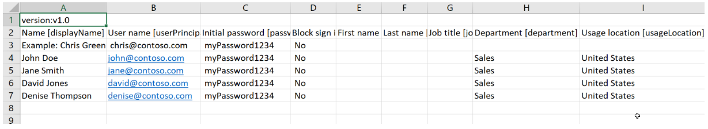
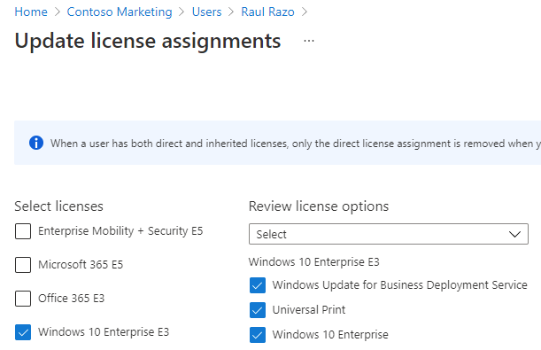

---
lab:
  title: 01 - Gérer les rôles d’utilisateurs
  learning path: '01'
  module: Module 01 - Implement an Identity Management Solution
---

# Locataires WWL - Conditions d’utilisation
Si un locataire vous est fourni dans le cadre d’une formation dispensée par un instructeur, notez qu’il est mis à votre disposition dans le seul but de prendre en charge les labos pratiques de la formation. Vous ne devez ni partager ni utiliser les locataires en dehors des labos pratiques. Le locataire utilisé dans ce cours est un locataire d’essai. Au terme de la classe, le locataire ne pourra pas faire l’objet d’une prolongation et vous ne pourrez plus l’utiliser ni y accéder. Vous n’êtes pas autorisé à convertir un locataire en abonnement payant. Les locataires obtenus dans le cadre de ce cours sont la propriété de Microsoft Corporation. Nous nous réservons le droit d’y accéder et d’en reprendre possession à tout moment. 


# Labo 01 : gérer les rôles utilisateur

## Scénario de l’exercice

Votre entreprise a récemment embauché un nouvel employé qui effectuera des tâches en tant qu’administrateur d’application. Vous devez créer un nouvel utilisateur et attribuer le rôle approprié.

#### Durée estimée : 30 minutes

### Exercice 1 - Créer un utilisateur et tester ses droits d’administrateur d’application

#### Tâche 1 - Ajouter un nouvel utilisateur

1. Connectez-vous à l’adresse  [https://entra.microsoft.com](https://entra.microsoft.com) en tant qu'administrateur général

2. Sélectionnez **Identité** dans le menu de gauche.

3. Dans le menu de navigation de gauche, sous **Utilisateurs**, sélectionnez **Tous les utilisateurs**, puis sélectionnez **+ Nouvel utilisateur** et **Créer nouvel utilisateur**.

4. Marquez le bouton **Créer un utilisateur**. Créez ensuite un utilisateur à l’aide des informations suivantes :

    | **Paramètre**| **Valeur**|
    | :--- | :--- |
    | Nom d’utilisateur principal| ChrisG|
    | Nom d’affichage| Chris Green|

5. Marquez l’option **Générer automatiquement le mot de passe**.

6. Copiez le mot de passe généré dans un emplacement que vous pouvez mémoriser pour la tâche suivante.

     *Vous devrez modifier le mot de passe lors de la première connexion à ce compte*

7. Sélectionnez **Vérifier + créer**. Sous l'écran de vérification, sélectionnez **Créer**. L’utilisateur est maintenant créé et inscrit auprès de votre organisation.

#### Tâche 2 : connexion et tentative de création d’une application

1. Lancez une nouvelle fenêtre du navigateur InPrivate.
2. Ouvrez le centre d’administration Microsoft Entra [https://entra.microsoft.com](https://entra.microsoft.com) en tant que Chris Green.

    | **Paramètre**| **Valeur**|
    | :--- | :--- |
    | Nom d'utilisateur| ChrisG@`your domain name.com`|
    | Mot de passe| Saisissez le mot de passe généré automatiquement à partir de la tâche précédente. |

3. Mettez à jour votre mot de passe

    | **Paramètre**| **Valeur**|
    | :--- | :--- |
    | Current Password| Utilisez un mot de passe généré automatiquement.|
    | Nouveau mot de passe| Saisissez un mot de passe unique et sécurisé |
    | Confirmer le mot de passe| Saisissez à nouveau un mot de passe unique et sécurisé |

4. Si vous voyez une **boîte de dialogue de visite guidée**, sélectionnez le bouton **Peut-être plus tard**.

5. Recherchez et sélectionnez **Applications d'entreprise** dans la boîte de dialogue de recherche en haut de l’écran.
7. Sélectionnez **+ Nouvelle application**. Notez que **+ Créer votre propre application** n’est pas disponible.

9. Essayez de sélectionner certains des autres paramètres tels que **Proxy d'application**, **Paramètres utilisateur** et d’autres pour voir que **Chris Green** n’a pas de droits.
10. Sélectionnez le nom de **ChrisG** dans le coin supérieur droit et déconnectez-vous.


### Exercice 2 - Attribuer le rôle d’administrateur d’application et créer une application

#### Étape 2 : attribuer un rôle à un utilisateur

En utilisant Microsoft Entra ID, vous pouvez désigner des administrateurs limités pour gérer les tâches d'identité dans des rôles moins privilégiés. Les administrateurs peuvent se voir attribuer des responsabilités comme l’ajout ou le changement d’utilisateurs, l’attribution de rôles d’administrateur, la réinitialisation des mots de passe utilisateur, la gestion des licences utilisateur et la gestion des noms de domaine.

1. Si vous n’êtes pas déjà connecté en tant que rôle de Global Administrator, ouvrez le Centre d’administration Microsoft Entra et connectez-vous.
2. Accédez à Identité, puis sélectionnez Page Utilisateurs.
3. Sélectionnez **Tous les utilisateurs** sous la section Gérer du menu.
4. Sélectionnez le compte **Chris Green**.
5. Choisissez **Rôles attribués** dans le menu Gérer.
6. Sélectionnez **+ Ajouter des attributions** et marquez le rôle `Application administrator`.
7. Sélectionnez **Ajouter**

    

**Remarque** : si l’environnement de labo a déjà activé Microsoft Entra ID Premium P2, Privileged Identity Management (PIM) est activé et vous devez sélectionner **Suivant** et attribuer un Rôle permanent à cet utilisateur.

9. Sélectionnez le bouton **Rafraîchir**.

**Remarque - Le rôle Administrateur d’application qui vient d’être attribué s’affiche dans la page Rôles affectés de l’utilisateur.**

#### Tâche 2 - Vérifier les autorisations d’application

1. Lancez une nouvelle fenêtre du navigateur InPrivate.
2. Ouvrez le centre d’administration Microsoft Entra [https://entra.microsoftcom](https://entra.microsoft.com) en tant que Chris Green.

    | **Paramètre**| **Valeur**|
    | :--- | :--- |
    | Nom d'utilisateur| ChrisG@`your domain name.com`|
    | Mot de passe| Saisissez le mot de passe unique et sécurisé que vous avez créé. |

3. Si vous voyez une boîte de dialogue **Bienvenue dans Microsoft Azure** , sélectionnez le bouton **Peut-être plus tard**.
4. Recherchez et sélectionnez **Applications d'entreprise** dans la boîte de dialogue de recherche en haut de l’écran.
5. Notez que **+ Nouvelle application** est disponible maintenant.
6. Sélectionnez **+ Nouvelle application**
7. Affichez **« **+ Créer votre propre application** n’est pas grisé. Si vous choisissez une application de galerie, vous verrez que le bouton **Créer** est disponible.

   **Remarque - Ce rôle a désormais la possibilité d’ajouter des applications au locataire. Nous allons expérimenter davantage cette fonctionnalité dans les laboratoires ultérieurs.**

7. Déconnectez-vous de l’instance Chris Green du portail Azure et fermez le navigateur.

### Exercice 3 - Supprimer une attribution de rôle

#### Tâche 1 - Supprimer l’administrateur de l’application de Chris Green

Cette tâche utilise une autre méthode pour supprimer le rôle affecté ; elle utilise l’option **Rôles et administrateurs** dans Azure AD.

1. Si vous n’êtes pas déjà connecté en tant que Global Admin, lancez le Centre d’administration Microsoft Entra et connectez-vous maintenant.
2. Dans la zone de recherche, saisissez **Rôles**, puis lancez les rôles et l’administration de Microsoft Entra ID.
3. Dans **Tous les rôles** de **Rôles et administrateurs**, sélectionnez le rôle **Administrateur de l’application** dans la liste.
4. Sur la page **Administrateur d’application | Affectations**, vous devriez voir le nom de Chris Green répertorié.
5. Cochez la case à côté de Chris Green.
6. Sélectionnez **X Supprimer les affectations** des options en haut de la boîte de dialogue.
7. Répondez **Oui** lorsque la boîte de confirmation s’ouvre.
8. Fermez l’écran.

### Exercice 4 - Importation en bloc d’utilisateurs

#### Tâche 1 - Opérations en bloc pour la création d’utilisateurs avec un fichier .csv

1. Dans le menu Microsoft Entra ID, commencez par ouvrir **Identité**, puis sélectionnez **Utilisateurs**, puis **Tous les utilisateurs**.

2. Sur la vignette **Utilisateurs | Tous les utilisateurs**, sélectionnez la flèche déroulante **Opérations en bloc**, puis **Créer en bloc**.

3. La sélection de **Créer en bloc** ouvre une nouvelle vignette. Cette vignette fournit un lien **Téléchargement** vers un fichier de modèle que vous allez modifier pour remplir vos informations utilisateur et charger pour ajouter la création en bloc d’utilisateurs.

4. Sélectionnez **Télécharger** pour télécharger le fichier .csv.

5. Le modèle .csv vous fournit les champs inclus dans le profil utilisateur. Cela inclut le nom d’utilisateur, le nom d’affichage et le mot de passe initial requis. Vous pouvez également compléter des champs facultatifs, tels que Département et Emplacement d’utilisation, pour l’instant. La capture d’écran suivante montre comment effectuer le fichier .csv : 

    

    Vous pouvez modifier ce fichier pour ajouter des utilisateurs en bloc.  Notez que vous n’avez pas besoin de remplir tout le champ.  En fonction des exemples de données fournis, vous devez principalement ajouter les informations de nom et de nom d’utilisateur.

6. Un exemple de fichier CSV a été fourni dans le dossier Allfiles/Lab1 -- **SC300BulkUser.csv**.
   1. Ouvrez le Bloc-notes.
     - Dans l’environnement de labo, sélectionnez le bouton DÉMARRER et saisissez Bloc-notes.  
   1. Ouvrez le fichier SC300BulkUser.csv
   1. Remplacez **Saisir votre nom de domaine** par le domaine de votre environnement de labo Azure.
   1. Enregistrez le fichier.

7. Dans la boîte de dialogue **Créer des utilisateurs en bloc**, sélectionnez l’icône de dossier de fichiers à l’étape 3.

8. Chemin d’accès au dossier Allfiles/Lab1 et sélectionnez le fichier**SC300BulkUser.csv**.

9. Sélectionnez **Ouvrir**.

7. Vous serez averti que le fichier a été chargé avec succès.  Choisissez **Envoyer** pour ajouter les utilisateurs. 

Une fois que les utilisateurs ont été créés, vous serez invité à indiquer que la création a réussi.  Fermez la vignette Créer des utilisateurs en bloc et les nouveaux utilisateurs seront renseignés dans la liste des **Utilisateurs | Tous les utilisateurs**. 

#### Tâche 2 - Ajout en bloc d’utilisateurs à l’aide de PowerShell

1. Ouvrez PowerShell ISE en tant qu’administrateur.  Pour ce faire, recherchez PowerShell dans Windows et choisissez Exécuter en tant qu’administrateur. 

**Remarque** - Vous devez disposer de PowerShell version 7.2 ou ultérieure pour que ce labo fonctionne.  Lorsque PowerShell s’ouvre, vous obtenez une version en haut de l’écran, si vous exécutez une version antérieure, suivez les instructions à l’écran pour accéder à https://aka.ms/PowerShell-Release?tag=7.3.9. Faites défiler jusqu’à la section ressources et sélectionnez powershell-7.3.1-win-x64.msi. Une fois le téléchargement terminé, sélectionnez Ouvrir le fichier. Installez à l’aide de toutes les valeurs par défaut.

2. Vous devez installer le module Microsoft.Graph PowerShell si vous ne l’avez pas déjà utilisé.  Exécutez les deux commandes suivantes, puis confirmez l’opération lorsque vous y êtes invité en appuyant sur Y :

    ```
    Install-Module Microsoft.Graph
    ```
3. Vérifiez que le module Microsoft.Graph est installé :

    ```
    Get-InstalledModule Microsoft.Graph
    ```
    

4. Ensuite, vous devez vous connecter à Azure en exécutant :  

    ```
    Connect-MgGraph -Scopes "User.ReadWrite.All"
    ``` 
    Le navigateur Edge s’ouvre et vous êtes invité à vous connecter.  Utilisez le compte MOD Administrator pour vous connecter.  Acceptez la demande d’autorisations ; fermez ensuite la fenêtre du navigateur.

5. Pour vérifier que vous êtes connecté et pour voir les utilisateurs existants, exécutez :  

    ``` 
    Get-MgUser 
    ```
    
7. Pour affecter un mot de passe temporaire commun à tous les nouveaux utilisateurs, exécutez la commande suivante et remplacez le <Enter a complex Password> par le mot de passe que vous souhaitez fournir à vos utilisateurs.  

    ``` 
    $PWProfile = @{
        Password = "<Enter a complex password you will>";
        ForceChangePasswordNextSignIn = $false
    }
    ```

8. Vous êtes prêt à créer un nouvel utilisateur.  La commande suivante est remplie avec les informations de l’utilisateur et s’exécute.  Si vous avez plusieurs utilisateurs à ajouter, vous pouvez utiliser un fichier txt du bloc-notes pour ajouter les informations utilisateur et copier/coller dans PowerShell. 

    ```
    New-MgUser `
        -DisplayName "New PW User" `
        -GivenName "New" -Surname "User" `
        -MailNickname "newuser" `
        -UsageLocation "USA" `
        -UserPrincipalName "newuser@<labtenantname.com>" `
        -PasswordProfile $PWProfile -AccountEnabled `
        -Department "Research" -JobTitle "Trainer"
    ```
**Remarque** : remplacez **labtenantname.com** par le nom **onmicrosoft.com** attribué par le locataire du labo.

## Tester la gestion des utilisateurs

Vous pouvez ajouter et supprimer des utilisateurs avec la page Microsoft Entra ID.  Toutefois, les utilisateurs peuvent être créés et les rôles peuvent être attribués à l’aide du script.  Essayez de donner au compte d’utilisateur Chris Green un autre rôle à l’aide d’un script. 
 

### Exercice 5 - Supprimer un utilisateur de Microsoft Entra ID

#### Tâche 1 - Supprimer un utilisateur

Il peut arriver qu’un compte soit supprimé, puis qu’il doive être récupéré. Vous devez vérifier que vous pouvez récupérer un compte qui a été supprimé récemment.

1. Accédez à [https://entra.micrososft.com](Microsoft Entra admin center).

2. Dans le volet de navigation de gauche, sous **Identité**, sélectionnez **Utilisateurs**.

3. Ouvrez la liste **Tous les utilisateurs**, cochez la case correspondant à un utilisateur qui sera supprimé. Par exemple, sélectionnez **Chris Green**.

    **Astuce** - La sélection d’utilisateurs dans la liste vous permet de gérer plusieurs utilisateurs en même temps. Si vous sélectionnez l’utilisateur, pour ouvrir la page de cet utilisateur, vous gérez uniquement cet utilisateur individuel.

    

4. Une fois le compte d’utilisateur sélectionné, dans le menu, sélectionnez **Supprimer**.

5. Examinez la boîte de dialogue, puis sélectionnez **Oui**.

#### Tâche 2 - Restaurer un utilisateur supprimé

1. Dans la page Utilisateurs, sélectionnez **Tous les utilisateurs** dans le volet de navigation de gauche, sélectionnez **Utilisateurs supprimés**.

2. Passez en revue la liste des utilisateurs supprimés et sélectionnez **Chris Green**.

    **Important** - Par défaut, les comptes d’utilisateur supprimés sont définitivement supprimés d’Azure Active Directory automatiquement après 30 jours.

3. Dans le menu, sélectionnez **Restaurer l’utilisateur**.

4. Examinez la boîte de dialogue, puis sélectionnez **Oui.**

5. Dans le volet de navigation gauche, sélectionnez **Tous les utilisateurs**.

6. Vérifiez que l’utilisateur a été restauré.


### Exercice 6 - Ajouter une licence Windows 10 à un compte d’utilisateur

#### Tâche 1 - Rechercher votre utilisateur sans licence dans Azure Active Directory

Certains comptes d'utilisateurs de votre organisation ne recevront pas tous les produits disponibles dans la licence qui leur a été attribuée ou auront besoin de mises à jour ou d'ajouts à la licence qui leur a été attribuée. Vous devez vous assurer que vous êtes en mesure de mettre à jour l’attribution de licence d’un compte d’utilisateur dans Azure AD.

1. Accédez à [https://entra.microsoft.com]( https://entra.microsoft.com).

2. Dans le menu de navigation de gauche, sous **Identité**, sélectionnez **Utilisateurs**, puis **Tous les utilisateurs**.

3. Dans la page Utilisateurs, saisissez **Raul** dans la zone de recherche.

4. Sélectionnez **Raul Razo**.

5. Passez en revue le profil de Raul et vérifiez qu’il dispose d’un ensemble d’Emplacements d’utilisation.

    **Avertissement** - Pour attribuer une licence à un utilisateur, l'utilisateur doit attribuer un emplacement d’utilisation à l’utilisateur.

6. Sélectionnez l’élément de menu **Licences** dans le menu de gauche.

7. Vérifiez que Raul a « Aucune attribution de licence trouvée ».

8. Revenez à **Tous les utilisateurs** dans le volet de navigation gauche, sous **Identité**, sélectionnez **Utilisateurs**

9. Dans la page Utilisateurs, sélectionnez **Raul Razo**.

10. Dans le volet de navigation gauche, sélectionnez **Licences**.

11. Sélectionnez le bouton **+ Affectations**. 

12. Dans la page Mettre à jour les attributions de licences, sélectionnez la zone case activée pour une licence **Windows 10/11 Entreprise E3**.

    

13. Quand vous avez terminé, sélectionnez **Enregistrer**.

14. En haut de l’écran, sélectionnez **Accueil**, puis **Contoso**, sélectionnez **Utilisateur**, puis **Raul Razo**.

15. Remarquez qu’aucune licence n’a été attribuée.
