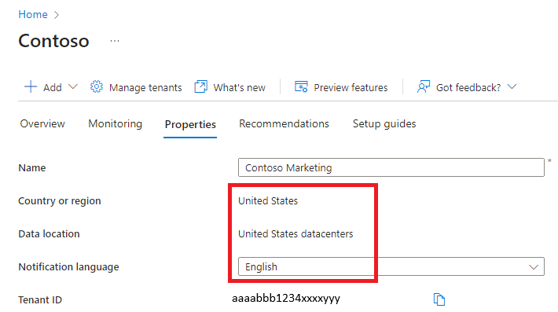
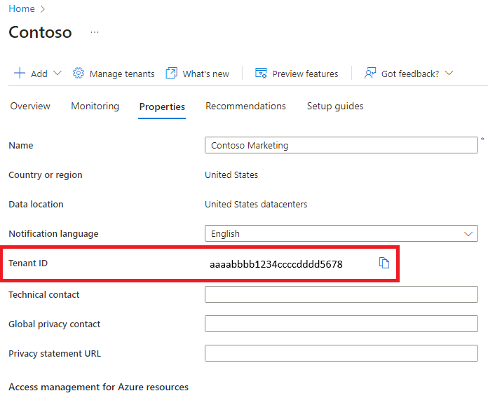
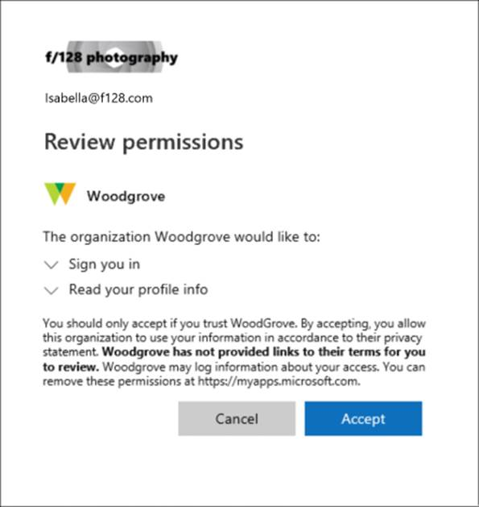

---
lab:
  title: "02\_: Utilisation des propriétés du locataire"
  learning path: '01'
  module: Module 01 - Implement an Identity Management Solution
---

# Labo 02 : Utiliser les propriétés du locataire

## Scénario de labo

Vous devez identifier et mettre à jour les différentes propriétés associées à votre locataire.

#### Durée estimée : 15 minutes

### Exercice 1 : Créer un sous-domaine personnalisé 

#### Tâche 1 : créer un sous-domaine personnalisé

1. Accédez au [https://entra.microsoft.com](https://entra.microsoft.com) et connectez-vous à l’aide d’un compte d’administrateur général pour le répertoire.

1. Dans le menu **Identité**, utilisez l’option **Afficher plus* en bas.

1.  Ouvrez le menu **Paramètres**, sélectionnez **Noms de domaine**.

1. Sélectionnez **+ Ajouter un domaine personnalisé**.

1. Dans le champ **Nom de domaine personnalisé**, créez un sous-domaine personnalisé pour le locataire de labo en plaçant **ventes** devant le nom de domaine **onmicrosoft.com**.  Le format ressemble à ce qui suit :

    ```
    sales.labtenant.onmicrosoft.com
    ```

1. **Remarque** : vous serez invité(e) à ouvrir le Centre d’administration Microsoft 365 pour effectuer cette action.

1. Sélectionnez **Ajouter un domaine** pour ajouter le sous-domaine.


### Exercice 2 : Modification du nom d’affichage du locataire

#### Tâche 1 : définir le nom du locataire et le contact technique

1. Dans le centre d’administration Microsoft Entra, ouvrez le menu **Identité** .

1. Dans le volet de navigation de gauche, sélectionnez l’élément de menu **Vue d’ensemble**, puis **Propriétés**.

1. Modifiez les propriétés du locataire pour le **Nom** et le **Contact technique** dans la boîte de dialogue.

    | **Paramètre** | **Valeur** |
    | :--- | :--- |
    | Nom | Contoso Marketing |
    | Contact technique | `your Global admin account` |

1. Sélectionnez **Enregistrer** pour mettre à jour les propriétés du locataire.

   **Vous remarquerez que le nom change immédiatement à la fin de l’enregistrement.**

#### Tâche 2 : passer en revue le pays ou la région et d’autres valeurs associées à votre locataire

1. Dans le menu **Identité**, sélectionnez **Vue d’ensemble**, puis **Propriétés**.

2. Sous **Propriétés du locataire**, recherchez **Pays ou région** et passez en revue les informations.

    **IMPORTANT** : lorsque le locataire est créé, c’est à ce moment que le pays ou la région sont spécifiés. Ce paramètre ne peut pas être modifié ultérieurement.

3. Sur la page **Propriétés**, sous **Propriétés du locataire**, recherchez ** Emplacement des données ** et passez en revue les informations.

    

#### Tâche 3 : rechercher l’ID de locataire

Les abonnements Azure ont une relation d’approbation avec Microsoft Entra ID. Microsoft Entra ID est utilisé pour authentifier les utilisateurs, les services et les appareils dans le cadre de l'abonnement. Chaque abonnement est associé à un ID de locataire et il existe plusieurs façons de trouver l’ID de locataire pour votre abonnement.

1. Ouvrir le centre d’administration Microsoft Entra [https://entra.microsoft.com](https://entra.microsoft.com)

1. Dans le menu **Identité**, sélectionnez **Vue d’ensemble**, puis **Propriétés**.

1. Sous **Propriétés du locataire**, localisez **ID du locataire**. Il s’agit de l’identificateur unique de votre locataire.

    

### Exercice 3 : Configuration de vos informations de confidentialité

#### Tâche 1 : ajout de vos informations de confidentialité sur Microsoft Entra ID, notamment le contact international chargé de la confidentialité et l’URL de déclaration de confidentialité

Microsoft vous recommande vivement d’ajouter votre contact international chargé de la confidentialité et la déclaration de confidentialité de votre organisation, pour que vos employés internes et invités externes puissent consulter vos stratégies. Étant donné que les déclarations de confidentialité sont particulièrement créées et adaptées à chaque entreprise, nous vous recommandons vivement de contacter un conseil juridique à des fins d’assistance.

   **REMARQUE** : pour plus d’informations sur l’affichage ou la suppression de données personnelles, consultez https://docs.microsoft.com/microsoft-365/compliance/gdpr-dsr-azure[](https://docs.microsoft.com/microsoft-365/compliance/gdpr-dsr-azure). Pour plus d’informations sur le RGPD, consultez [https://servicetrust.microsoft.com/ViewPage/GDPRGetStarted](https://servicetrust.microsoft.com/ViewPage/GDPRGetStarted).

Vous ajoutez les informations de confidentialité de votre organisation dans la zone  **Propriétés**  de Microsoft Entra ID. Accéder à la zone Propriétés et ajouter vos informations de confidentialité :

1. Dans le menu **Identité**, sélectionnez **Vue d’ensemble**, puis **Propriétés**.

    

2. Ajoutez vos informations de confidentialité pour vos employés :

- **Contact global de confidentialité avec** - `AllanD@` **votre domaine de labo Azure**
     - Allan Deyoung est un utilisateur intégré dans votre locataire de laboratoire Azure, qui travaille en tant qu’administrateur informatique. Nous l’utiliserons comme contact de confidentialité.
     - Cette personne est également la personne que Microsoft contacte en cas de fuite de données. Si aucune personne n’est répertoriée ici, Microsoft contacte vos administrateurs généraux.

- **URL de la déclaration de confidentialité.** -  <https://github.com/MicrosoftLearning/SC-300-Identity-and-Access-Administrator/blob/master/Allfiles/Labs/Lab2/SC-300-Lab_ContosoPrivacySample.pdf>

     - Dans l’exemple de fichier PDF de confidentialité, vous trouverez dans votre répertoire de labo.
     -°Tapez le lien vers le document de votre organisation qui décrit la façon dont elle gère la confidentialité des données des utilisateurs internes et des invités externes.

    **IMPORTANT** : si vous n’incluez pas votre propre déclaration de confidentialité ou votre contact chargé de la confidentialité, vos invités externes verront le texte inclus dans la zone Révision des autorisations qui indique  **<your org name>\>n’a fourni aucun lien vers ses conditions pour vous permettre de les examiner**. Par exemple, un utilisateur invité voit ce message quand il reçoit une invitation à accéder à une organisation par le biais d’une B2B.

    

3. Sélectionnez **Enregistrer**.

#### Tâche 2 : vérifier votre déclaration de confidentialité

1. Revenez à l’écran d’accueil Azure : tableau de bord.
2. Sélectionnez votre nom d’utilisateur en haut à droite de l’interface.
3. Sélectionnez **Afficher le compte** dans le menu déroulant.

     **Un nouvel onglet de navigateur s’ouvre automatiquement.**

4. Sélectionnez **Paramètres et confidentialité** dans le menu de gauche.
5. Sélectionnez **Confidentialité**.
6. Sous **Avis de l’organisation**, sélectionnez l’élément **Afficher** en regard de la déclaration de confidentialité de l’organisation Contoso Marketing.

     **Un nouvel onglet de navigateur s’ouvre avec le fichier PDF Privacy que vous avez joint.**

7. Passez en revue l’exemple de déclaration de confidentialité.
8. Fermez l’onglet du navigateur incluant le fichier PDF.
9. Fermez l’onglet du navigateur affichant les éléments **Mon compte**.
