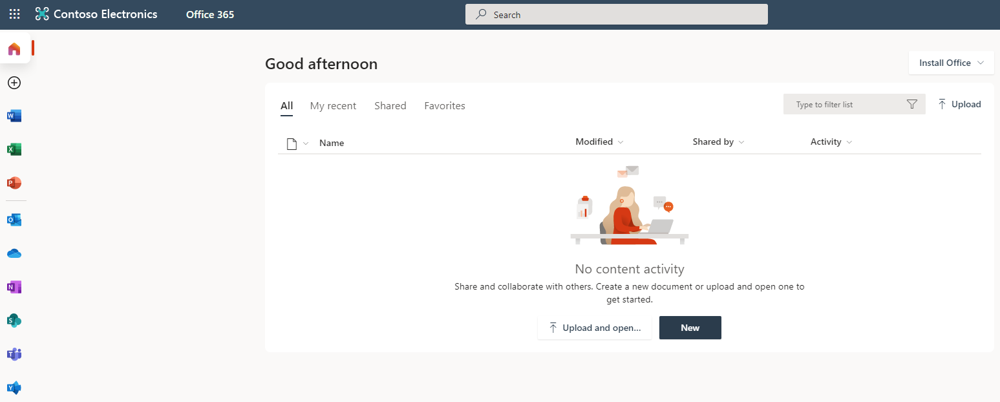

---
lab:
  title: "03\_: Attribution d’une licence à l’aide de l’appartenance au groupe"
  learning path: '01'
  module: Module 01 - Implement an identity management solution
---

# Labo 03 : Attribution d’une licence à l’aide de l’appartenance au groupe

## Scénario de labo

Votre organisation a décidé d’utiliser des groupes de sécurité dans Microsoft Entra ID, pour gérer les licences. Vous devez configurer un nouveau groupe de sécurité, attribuer une licence à ce groupe et vérifier que les licences membres du groupe ont été mises à jour.

#### Durée estimée : 25 minutes

### Exercice 1 : Créer un groupe de sécurité et ajouter un utilisateur

#### Tâche 1 : vérifier si Delia Dennis a accès à Office 365

1. Lancez une nouvelle fenêtre de navigateur InPrivate.
2. Se connecter à [https://www.office.com](https://www.office.com).
3. Sélectionnez Se connecter et connectez-vous en tant que Delia Dennis.

   | **Paramètre**| **Valeur**|
   | :--- | :--- |
   | Nom d’utilisateur | DeliaD@`your domain name.com`|
   | Mot de passe| Saisissez le mot de passe de l’administrateur général à partir des ressources|

4. Vous devez vous connecter au site web Office.com et voir un message indiquant que vous n’avez pas de licence.

   
    
5. Fermez la fenêtre du navigateur.

#### Tâche 2 : créer un groupe de sécurité dans Microsoft Entra ID

1. Accédez à [https://entra.microsoft.com](https://entra.microsoft.com).

2. Dans le volet de navigation de gauche sous **Identité**, sélectionnez **Groupes**, puis **Tous les groupes**.
3. Sur la page Groupes, dans le menu, sélectionnez **Nouveau groupe**.
4. Créez un nouveau groupe à l’aide des informations suivantes :

   | **Paramètre**| **Valeur**|
   | :--- | :--- |
   | Type de groupe| Sécurité|
   | Nom du groupe| sg-SC300-O365|
   | Type d’appartenance| Attribué|
   | Propriétaires| *Affecter votre propre compte d’administrateur en tant que propriétaire du groupe*|

5. Sous Membres, sélectionnez **Aucun membre sélectionné**.
6. Sélectionnez **Delia Dennis** dans la liste des utilisateurs.
7. Cliquez sur le bouton **Sélectionner**.

   

8. Cliquez sur le bouton **Créer**.
9. Lorsque vous avez terminé, vérifiez que le groupe **sg-SC300-O365** est affiché dans la liste **Tous les groupes**.

#### Tâche 3 : affecter une licence à un groupe

1. Dans la liste **Tous les groupes**, sélectionnez **sg-SC300-O365**.
2. Sur la page Marketing, sous **Gérer**, sélectionnez **Licences**.
3. Dans le menu, sélectionnez **Affectations**.
4. Dans les affectations de licence de mise à jour, sous **Sélectionner des licences**, passez en revue la liste des licences disponibles, puis cochez la case correspondant à **Office 365 E3**.

   **Conseil :** lorsque plusieurs licences sont sélectionnées, vous pouvez utiliser le menu Consulter les options de licence pour sélectionner une licence spécifique et afficher son option de licence.

   

6. Sélectionnez **Enregistrer**.

#### Tâche 4 : confirmer la licence Office 365

1. Lancez une nouvelle fenêtre de navigateur InPrivate.
2. Se connecter à [https://www.office.com](https://www.office.com).
3. Sélectionnez Se connecter et connectez-vous en tant que Delia Dennis.

   | **Paramètre**| **Valeur**|
   | :--- | :--- |
   | Nom d’utilisateur | DeliaD@`your domain name.com`|
   | Mot de passe| Saisissez le mot de passe de l’administrateur général à partir des ressources|

4. Vous devez vous connecter au site web Office.com et ne voir aucun message concernant la licence. Toutes les application Office sont disponibles à gauche.

   
    
5. Fermez la fenêtre du navigateur. 

### Exercice 2 – Créer un groupe Microsoft 365 dans Microsoft Entra ID

#### Tâche 1 : créer le groupe

Une partie de vos tâches en tant qu’administrateur Microsoft Entra consiste à créer différents types de groupes. Vous devez créer un groupe Microsoft 365 pour le service commercial de votre organisation.

1. Accédez à [https://entra.microsoft.com]( https://entra.microsoft.com).

2. Dans le volet de navigation de gauche sous **Identité**, sélectionnez **Groupes**, puis **Tous les groupes**.

3. Sur la page Groupes, dans le menu, sélectionnez **Nouveau groupe**.

4. Créez un nouveau groupe à l’aide des informations suivantes :

   | **Paramètre**| **Valeur**|
   | :--- | :--- |
   | Type de groupe| Microsoft 365|
   | Nom du groupe| Northwest Sales|
   | Type d’appartenance| Attribué|
   | Propriétaires| *Affecter votre propre compte d’administrateur en tant que propriétaire du groupe*|
   | Membres| **Alex Wilber** et **Bianca Pisani**|

   

5. Lorsque vous avez terminé, vérifiez que le groupe **Northwest Sales** est affiché dans la liste **Tous les groupes**.

### Exercice 3 : Créer un groupe dynamique comprenant tous les utilisateurs en tant que membres

#### Tâche 1 : créer le groupe dynamique

À mesure que votre entreprise se développe, la gestion manuelle des groupes devient de plus en plus longue. Depuis la normalisation du répertoire, vous pouvez désormais tirer parti des groupes dynamiques. Vous devez créer un groupe dynamique pour vous assurer que vous êtes prêt(e) à créer un groupe dynamique en production.

1. Connectez-vous au [https://entra.microsoft.com](https://entra.microsoft.com) en utilisant un compte attribué au rôle d’administrateur général ou d’administrateur d’utilisateurs dans le locataire.

2. Sélectionnez **Identité**.

3. Sous **Groupes**, sélectionnez **Tous les groupes**, puis **Nouveau groupe**.

4. Sur la page Nouveau groupe, sous **Type de groupe**, sélectionnez **Sécurité**.

5. Dans la zone **Nom du groupe**, entrez **SC300-myDynamicGroup**.

6. Sélectionnez le menu **Type d’appartenance**, puis sélectionnez **Utilisateur dynamique**.

7. Sélectionnez un **Propriétaire** pour le groupe.

7. Sous **Membres dynamiques**, sélectionnez **Ajouter une requête dynamique**.

8. À droite au-dessus de la zone **Syntaxe de la règle**, sélectionnez **Modifier**.

9. Dans le volet « Modifier la syntaxe de la règle », entrez l’expression suivante dans la zone **Syntaxe de la règle** :

   ```powershell
   user.objectid -ne null
   ```

   **Avertissement** : la `user.objectid` est sensible à la casse.

10. Cliquez sur **OK**. La règle s’affiche dans la zone « Syntaxe de la règle ».

   

11. Sélectionnez **Enregistrer**. Le nouveau groupe dynamique inclut désormais les utilisateurs invités B2B, ainsi que les utilisateurs membres.

12. Sur la page « Nouveau groupe », sélectionnez **Créer** pour créer le groupe.

#### Tâche 2 : vérifier que les membres ont été ajoutés

**Remarque** : la propagation de l’appartenance au groupe dynamique peut prendre jusqu’à 15 minutes.

1. Sélectionnez sur la **page d’accueil ** `Microsoft Entra admin center`.
2. Ouvrez **Identité**.
3. Dans le menu **Groupes**, sélectionnez **Tous les groupes**.
4. Dans la zone de filtre, tapez **SC300** et votre groupe nouvellement créé sera répertorié.
5. Sélectionnez **SC300-myDynamicGroup** pour ouvrir le groupe.
6. Notez qu’il indique qu’il contient plus de 30 *membres directs**.
7. Dans la section **Gérer**, sélectionnez **Membres**.
8. Révisez les membres.

#### Tâche 3 : expérimenter avec d’autres règles

1. Essayez de créer un groupe comprenant uniquement **les utilisateurs invités** :

   - (user.objectid -ne null) et (user.userType -eq « Guest »)

2. Essayez de créer un groupe comprenant uniquement les **Membres** des utilisateurs de Microsoft Entra.

   - (user.objectid -ne null) et (user.userType -eq "Member")
