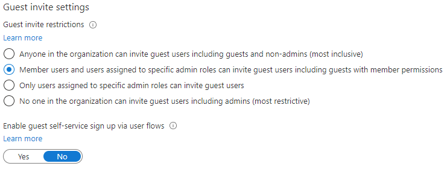

---
lab:
  title: 4 - Configurer les paramètres de collaboration externe
  learning path: '01'
  module: Module 01 - Implement an identity management solution
---

# Labo 4 - Configurer les paramètres de collaboration externe

## Scénario de l’exercice

Vous devez activer les paramètres de collaboration externe pour votre organisation pour l’accès aux invités approuvés.

#### Durée estimée : 5 minutes

### Exercice 1 - Autoriser les utilisateurs invités à être invités dans votre organisation

#### Tâche 1 - Permettre aux utilisateurs invités d’effectuer une inscription en libre-service

1. Connectez-vous au site [</bpt>"> [https://portal.azure.com](https://portal.azure.com) en tant qu’administrateur de locataire.
2. Sélectionnez **</bpt>"> **Azure Active Directory**.
3. Sélectionner **Paramètres utilisateur**.
4. Sélectionnez **Gérer les paramètres de collaboration utilisateur externe**.
5. Vérifiez que le paramètre **Activer l’inscription en libre-service pour les invités via les flux d’utilisateurs** est défini sur **OUI**.
6. Sélectionnez **Enregistrer** en haut de l’écran.

#### Tâche 2 - Configurer les paramètres de collaboration externe

1. Connectez-vous au site [</bpt>"> [https://portal.azure.com](https://portal.azure.com) en tant qu’administrateur de locataire.
2. Sélectionnez **</bpt>"> **Azure Active Directory**.
3. Sélectionnez  **Identités externes > Tous les fournisseurs d’identité**.
4. Sélectionnez le lien de notification **Code secret à usage unique par e-mail** que vous voyez en haut de l’écran.

    **Remarque** : un code secret à usage unique est un moyen très sécurisé d’inviter un utilisateur à rejoindre votre organisation.
    
5. Vérifiez que l’option **Oui** est sélectionnée.
6. Si nécessaire, sélectionnez **Enregistrer**.
7. Sinon, sélectionnez `Home > Contoso Marketing >`**Identités** externes pour revenir à l’écran précédent.
8. Sélectionnez **Paramètres de collaboration externe** sur la gauche.

9. Sous  **Accès utilisateur invité**, passez en revue les niveaux d’accès disponibles, puis sélectionnez **L’accès des utilisateurs invités est limité aux propriétés et aux membres de leurs propres objets de répertoire (le plus restrictif)**.

    **REMARQUE**
    - Les utilisateurs invités ont le même accès que les membres (le plus inclusif) : Cette option donne aux invités le même accès aux ressources Azure AD et aux données d’annuaire que les utilisateurs membres.
    - Les utilisateurs invités ont un accès limité aux propriétés et aux appartenances des objets d’annuaire : Ce paramètre empêche les invités d’effectuer certaines tâches d’annuaire, telles que l’énumération d’utilisateurs, de groupes ou d’autres ressources de répertoire. Les invités peuvent voir l’appartenance de tous les groupes non masqués.
    - L’accès utilisateur invité est limité aux propriétés et aux appartenances de ses propres objets d’annuaire (le plus restrictif) : Avec ce paramètre, les invités ne peuvent accéder qu’à leurs propres profils. Les invités ne sont pas autorisés à voir les profils, groupes ou appartenances à des groupes d’autres utilisateurs.

    

10. Sous  **Paramètres d’invitation d’invité**, sélectionnez **Utilisateurs membres et utilisateurs affectés à des rôles d’administrateur spécifiques peuvent convier des utilisateurs invités, notamment des invités disposant d’autorisations de membre** !

    **REMARQUE**
    - Toute personne de l’organisation peut inviter des utilisateurs invités, y compris des invités et des non administrateurs (option la plus inclusive) : Pour permettre aux invités de l’organisation d’inviter d’autres invités, y compris ceux qui ne sont pas membres de l’organisation, sélectionnez cette case d’option.
    - Les utilisateurs membres et les utilisateurs affectés à des rôles Administrateur spécifiques peuvent inviter des utilisateurs invités, y compris des invités disposant d’autorisations de membre : Pour permettre aux utilisateurs membres et aux utilisateurs ayant des rôles Administrateur spécifiques d’inviter des invités, sélectionnez cette case d’option.
    - Seuls les utilisateurs affectés à des rôles Administrateur spécifiques peuvent inviter des utilisateurs invités : Pour autoriser uniquement les utilisateurs ayant des rôles Administrateur à inviter des invités, sélectionnez cette case d’option. Les rôles Administrateur sont les suivants : Administrateur général, Administrateur d’utilisateurs et Inviteur.
    - Aucune personne dans l’organisation ne peut inviter des utilisateurs invités, y compris les administrateurs (option la plus restrictive) : Pour empêcher toute personne dans l’organisation d’inviter des invités, sélectionnez cette case d’option.
    - Si Les membres peuvent inviter est défini sur Non et Les administrateurs et utilisateurs ayant le rôle d’Inviteur d’invités peuvent inviter est défini sur Oui, les utilisateurs du rôle Inviteur d’invité pourront toujours inviter des utilisateurs.

    

11. Sous  **Restrictions de collaboration**, passez en revue les options disponibles et appliquez les paramètres par défaut.

    **IMPORTANT**
    - Vous pouvez créer une liste verte ou une liste d’exclusion. Vous ne pouvez pas configurer les deux types de listes. Par défaut, les domaines qui ne sont pas dans la liste verte sont dans la liste d’exclusion et vice versa.
    - Vous ne pouvez créer qu’une seule stratégie par organisation. Vous pouvez mettre à jour la stratégie pour inclure plusieurs domaines ou vous pouvez supprimer la stratégie pour en créer une nouvelle.
    - Le nombre de domaines que vous pouvez ajouter à une liste verte ou à une liste d’exclusion n’est limité que par la taille de la stratégie. La taille maximale de la stratégie entière est de 25 Ko (25 000 caractères). Elle comprend la liste verte ou la liste d’exclusion et tous les autres paramètres configurés pour d’autres fonctionnalités.
    - Cette liste fonctionne indépendamment à partir des listes vertes/rouges OneDrive Entreprise et SharePoint Online. Si vous souhaitez restreindre le partage des fichiers individuels dans SharePoint Online, vous devez configurer une liste verte ou d’exclusion pour OneDrive Entreprise et SharePoint Online.
    - La liste ne s’applique pas aux utilisateurs externes qui ont déjà utilisé l’invitation. La liste est appliquée une fois configurée. Si une invitation de l’utilisateur est en attente et que vous définissez une stratégie qui bloque leur domaine, la tentative de l’utilisateur d’utiliser l’invitation échoue.

12. Quand vous avez terminé, **enregistrez** les modifications.
