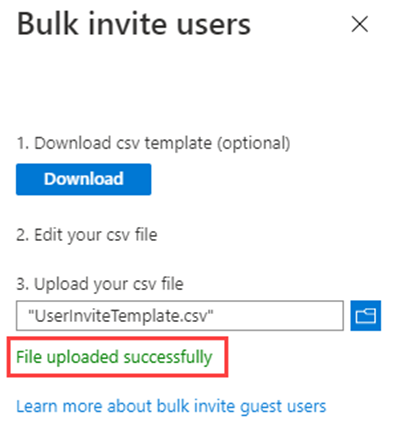
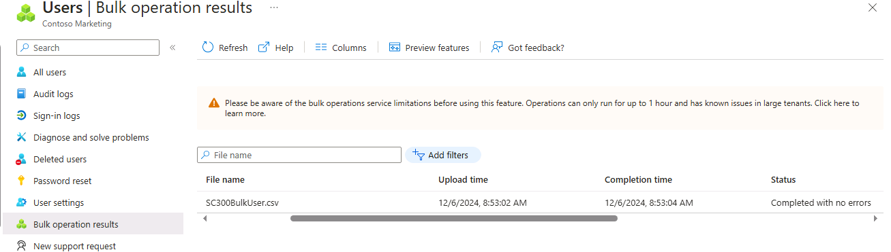

---
lab:
  title: "05\_: Ajouter des utilisateurs invités au répertoire"
  learning path: '01'
  module: Module 01 - Implement an identity management solution
---

# Labo 05 : Ajouter des utilisateurs invités à l’annuaire

### Type de connexion = Administrateur Microsoft 365

## Scénario de labo

Votre entreprise travaille avec de nombreux fournisseurs et, à l’occasion, vous devez ajouter des comptes de fournisseurs à votre répertoire en tant qu’invités.

#### Durée estimée : 20 minutes

### Exercice 1 : Ajouter des utilisateurs invités au répertoire

#### Tâche : ajouter un utilisateur invité

1. Connectez-vous au  [https://entra.Microsoft.com](https://entra.microsoft.com)  en tant qu’utilisateur affecté à un rôle d’administrateur limité de répertoire, à un rôle d’inviteur d’invités ou en tant qu’administrateur général.

2. Sélectionnez  **Identité**.

3. Sous  **Utilisateurs**, sélectionnez  **Tous les utilisateurs**.

4. Sélectionnez  **+ Nouvel utilisateur**.

5. Dans le menu Nouvel utilisateur, sélectionnez **Inviter un utilisateur externe**, puis ajoutez vos informations d’utilisateur invité.

    **REMARQUE** : les adresses e-mail de groupe ne sont pas prises en charge. Veuillez entrer des adresses e-mail individuelles. Certains fournisseurs de messagerie permettent aux utilisateurs d’ajouter un signe plus (+) et du texte à leurs adresses e-mail pour faciliter notamment le filtrage de la boîte de réception. Toutefois, Microsoft Entra ID ne prend actuellement pas en charge les symboles plus dans les adresses e-mail. Pour éviter les problèmes de livraison, omettez le signe plus (+) et les caractères après celui-ci jusqu’au symbole @.

6. Entrez une adresse e-mail, telle que **sc300externaluser1@sc300email.com**.

7. Sélectionnez l’onglet **Propriétés**.

8. Sur la page Utilisateurs, vérifiez que votre compte est listé et, dans la colonne **Type d’utilisateur**, vérifiez que **Invité** est affiché.

9. Une fois terminé, sélectionnez **Vérifier + inviter**, puis **Inviter**.


Après avoir envoyé l’invitation, le compte d’utilisateur est automatiquement ajouté au répertoire en tant qu’invité.


### Exercice 2 : Inviter des utilisateurs en bloc

#### Tâche 1 : inviter des utilisateurs en bloc

Un partenariat récent a été établi avec une autre société. Pour l’instant, les employés de l’entreprise partenaire seront ajoutés en tant qu’invités. Vous devez vous assurer que vous pouvez importer plusieurs utilisateurs invités à la fois.

1. Connectez-vous à la plateforme [https://entra.microsoft.com](https://entra.microsoft.com) en tant qu’administrateur global.

2. Dans le volet de navigation, sélectionnez **Identity**.

3. Sous **Utilisateurs**, sélectionnez **Tous les utilisateurs**.

4. Sur la page Utilisateurs, dans le menu, sélectionnez **Opérations en bloc - Invitation en bloc**.

   

5. Dans le Panneau utilisateurs d’invitation en bloc, sélectionnez **Télécharger** vers un exemple de modèle CSV avec les propriétés de l’invitation.

6. À l’aide d’un éditeur pour afficher le fichier CSV, passez en revue le modèle.

7. Ouvrez le modèle CSV et ajoutez une ligne pour chaque utilisateur invité. Les valeurs obligatoires sont les suivantes :

    - **Adresse e-mail à inviter** : utilisateur qui recevra une invitation
    - **URL de redirection** : URL vers laquelle l’utilisateur invité est transféré après avoir accepté l’invitation.

    

**Conseil pour le labo** : les utilisateurs répertoriés dans la capture d’écran et les fichiers de modèle sont des exemples, ils n’existent pas vraiment.  Vous devrez ajouter des utilisateurs réels pour tester entièrement cette fonctionnalité.

8. Enregistrez le fichier.

9. Dans la page Inviter des utilisateurs en bloc, sous **Chargez votre fichier CSV**, accédez au fichier.

     **Remarque** : quand vous sélectionnez le fichier, la validation du fichier CSV démarre.

10. Quand le contenu du fichier est validé, un message indique **Fichier chargé**. Si des erreurs sont présentes, vous devez les corriger avant de pouvoir envoyer le travail.

    

11. Une fois votre fichier validé, sélectionnez **Envoyer** pour démarrer l’opération en bloc Azure qui ajoute les invitations.

12. Pour voir l’état du travail, sélectionnez **Cliquez ici pour afficher l’état de chaque opération**. Vous pouvez également sélectionner **Résultats de l’opération en bloc** dans la section Activité. Pour plus d’informations sur chaque élément de ligne au sein de l’opération en bloc, sélectionnez les valeurs sous les colonnes **Nombre de réussites**, **Nombre d’échecs** ou **Nombre total de requêtes**. Si des échecs se sont produits, les raisons sont affichées.

    

13. Une fois le travail terminé, vous recevez une notification indiquant que l’opération en bloc a réussi.

#### Tâche 2 : inviter des utilisateurs avec PowerShell

1. Ouvrez PowerShell en tant qu’administrateur. Pour ce faire, recherchez PowerShell dans Windows et choisissez Exécuter en tant qu’administrateur. 

**Remarque** : vous devez disposer de PowerShell version 7.2 ou ultérieure pour que ce labo fonctionne.  Lorsque PowerShell s’ouvre, vous obtenez une version en haut de l’écran. Si vous l’exécutez et que vous avez une version antérieure, mettez à jour ou cette partie du labo échouera.

**Conseil pour le labo** : la fonctionnalité TouchType dans l’environnement de labo présente des problèmes de saisie dans PowerShell. Si vous lancez le Bloc-notes dans votre labo, utilisez TouchType pour charger les instructions PowerShell dans le Bloc-notes. Vous pouvez utiliser **Copier et coller** pour les saisir dans PowerShell sans taper.

2. Vous devez installer le module PowerShell Microsoft.Graph si vous ne l’avez pas déjà utilisé.  Exécutez la commande suivante, puis confirmez l’opération lorsque vous y êtes invité(e) :

    ```
    Install-Module Microsoft.Graph
    ```
3. Vérifiez que le module Microsoft.Graph est installé :

    ```
    Get-InstalledModule Microsoft.Graph
    ```
    

4. Ensuite, vous devez vous connecter à Azure en exécutant :  

    ```
    Connect-MgGraph -Scopes "User.ReadWrite.All"
    ``` 
    Le navigateur Edge s’ouvre et vous êtes invité(e) à vous connecter.  Utilisez le compte Administrateur MOD pour vous connecter.  Cochez la case de consentement, puis acceptez la demande d’autorisations. Fermez ensuite la fenêtre du navigateur.

5. Définissez les valeurs de l’e-mail et redirigez-les pour l’utilisateur externe :

    ```
    Import-Module Microsoft.Graph.Identity.SignIns
    
    $params = @{
        invitedUserEmailAddress = "admin@fabrikam.com"
        inviteRedirectUrl = "https://myapp.contoso.com"
    }
    ```

6. Utilisez la commande MgInvitation pour inviter l’utilisateur externe :

    ```
    New-MgInvitation -BodyParameter $params
    ```

7. Vous pouvez à présent fermer PowerShell.
    
Vous savez maintenant comment inviter des utilisateurs dans le centre d’administration Microsoft Entra et le centre d’administration Microsoft 365, inviter des invitations en bloc avec un fichier CSV et inviter des utilisateurs avec des commandes PowerShell.  Vous pouvez accéder au centre d’administration Microsoft Entra et cocher la case Tous les utilisateurs pour voir que l’administrateur a été ajouté en tant qu’utilisateur externe.
