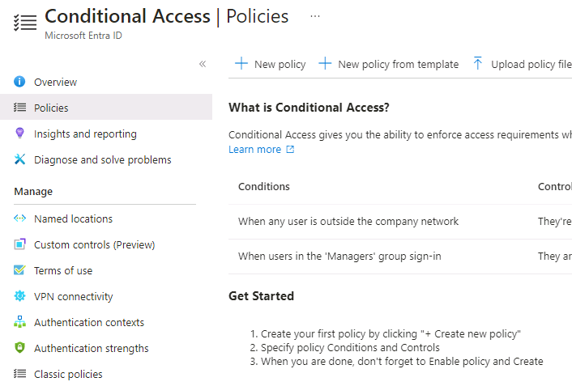

---
lab:
  title: "08\_: Activer l’authentification multifacteur."
  learning path: '02'
  module: Module 02 - Implement an Authentication and Access Management Solution
---

# Labo 08 : Activer l’authentification multifacteur.

### Type de connexion = Administrateur Microsoft 365

## Scénario de labo

Pour renforcer la sécurité de votre organisation, vous avez été dirigé vers l’activation de l’authentification multifacteur pour Microsoft Entra ID.

#### Durée estimée : 15 minutes

**IMPORTANT** : une licence Microsoft Entra ID Premium est requise pour cet exercice.

### Exercice 1 : Vérifier et activer l’authentification multifacteur dans Azure

#### Tâche 1 : examiner les options d’authentification multifacteur d’Azure

1. Accédez au [https://entra.microsoft.com](https://entra.microsoft.com) et connectez-vous à l’aide d’un compte d’administrateur général pour le répertoire.

2. Utilisez la fonctionnalité de recherche et recherchez **multifacteur**.

3. Dans les résultats de la recherche, sélectionnez **Authentification multifacteur**.

    Vous pouvez également ouvrir **Identité**, sélectionner **Protection**, puis **Authentification multifacteur**.

4. Sur la page Démarrer, sélectionnez **Paramètres supplémentaires de MFA basée sur le cloud** sous **Configurer**.

    

5. Dans la nouvelle page du navigateur, vous pouvez voir les options MFA pour les utilisateurs et les paramètres de service Azure.

    

    C’est là que vous sélectionnez les méthodes d’authentification prises en charge. Dans l’écran ci-dessus, toutes sont sélectionnées.

    Ici, vous pouvez aussi activer ou désactiver les mots de passe d’application, ce qui permet aux utilisateurs de créer des mots de passe de compte uniques pour les applications qui ne prennent pas en charge l’authentification multifacteur. Cette fonctionnalité permet à l’utilisateur de s’authentifier avec son identité Microsoft Entra en utilisant un mot de passe différent propre à cette application.

#### Tâche 2 : configurer des règles d’accès conditionnel de MFA pour Delia Dennis

Nous allons maintenant examiner comment configurer des règles de stratégie d’accès conditionnel afin que les utilisateurs invités utilisent l’authentification multifacteur (MFA) pour accéder à des applications spécifiques sur votre réseau.

1. Dans le Centre d’administration Microsoft Entra, accédez à **Identité**, **Protection**, puis à **Accès conditionnel**.

2. Dans le menu, sélectionnez **+ Nouvelle stratégie**. Sélectionnez **+ Créer une stratégie ** dans le menu déroulant.

    

3. Nommez votre stratégie, par exemple **MFA_for_Delia**.

4. Sous Affectations, sélectionnez **Utilisateurs ou identités de charge de travail**.

    - Sélectionnez **Aucun utilisateur ou identité de charge de travail sélectionné**  
    - Dans l’écran de droite, cochez la case **Sélectionner des utilisateurs et des groupes** pour configurer.
    - Vérifier les **utilisateurs et les groupes** (les utilisateurs disponibles sont listés à droite)
    - Choisissez **Delia Dennis** dans la liste des utilisateurs, puis cliquez sur le bouton **Sélectionner**.

5. Sous Ressources cibles, sélectionnez **Aucune ressource cible sélectionnée**.

   - Dans la liste déroulante, vérifiez que **Cloud Apps** est sélectionné.
   - Sous Inclure, marquez **Toutes les Cloud Apps** et souvenez-vous de l’avertissement sur le verrouillage possible de votre accès. 
   - Maintenant, dans la section Sélectionner, choisissez l’élément **Aucun**.
   - Dans la boîte de dialogue nouvellement ouverte, choisissez **Office 365**.
      - **Rappel :** dans un labo précédent, nous avons donné à Delia Dennis une licence Office 365 et nous sommes connectés pour s’assurer qu’elle fonctionnait.
   - Choisissez **Sélectionner**.

6. Passez en revue la section Conditions.

   - Choisissez **Oui** pour le curseur de configuration.
   - Sélectionnez **N’importe quel réseau ou emplacement**.

7. Sous **Contrôles d’accès** trouvez la section **Accorder**, et sélectionnez **Aucun contrôle sélectionné**.

8. Cochez la case **Exiger l’authentification multifacteur** pour appliquer la MFA

9. Vérifiez que l’option **Exiger tous les contrôles sélectionnés** est sélectionnée.

10. Sélectionnez **Sélectionner**.

11. Définissez l’option **Appliquer la stratégie** sur **Activé**.

12. Sélectionnez **Créer** pour créer la stratégie.

    

    La MFA est maintenant activée pour votre utilisateur et votre/vos applications sélectionnées. La prochaine fois qu’un invité tentera de se connecter à cette ou ces applications, il sera invité à s’inscrire pour MFA.

#### Tâche 3 : tester l’authentification de Delia

1. Ouvrez une nouvelle fenêtre de navigateur InPrivate.
2. Se connecter à https://www.office.com.
3. Sélectionnez l’option de connexion.
4. Entrez **DeliaD@** `<<your domain address>>`.
5. Entrez le mot de passe administrateur général du locataire (remarque : reportez-vous à l’onglet Ressources du labo pour récupérer le mot de passe d’administrateur).

**Remarque :** à ce stade, il y a deux cas de figure possibles.  Vous devez recevoir un message indiquant que vous devez configurer l’application Authenticator et l’authentification multifacteur.  Suivez les invites en utilisant votre téléphone personnel.  REMARQUE : il est possible que vous obteniez un message d’échec de connexion avec plusieurs options sur la procédure à suivre.  Dans ce cas, sélectionnez l’option **Réessayer**

Vous pouvez voir qu’en raison de la règle d’accès conditionnel que nous avons créée pour Delia, l’authentification multifacteur est requise pour lancer la page d’accueil d’Office 365.

### Exercice 2 : Configurer l’authentification multifacteur pour qu’elle soit requise pour la connexion

#### Tâche 1 : configurer la MFA pour les utilisateurs de Microsoft Entra

Enfin, nous allons voir comment configurer MFA pour les comptes d’utilisateur. Il s’agit d’une autre façon d’accéder aux paramètres d’authentification multifacteur.

1. Revenez au centre d’administration Microsoft Entra et recherchez le menu de navigation gauche Identité.

2. Sélectionnez **Utilisateurs**, puis **Tous les utilisateurs**.

3. Sélectionnez **MFA par utilisateur** dans le menu supérieur du volet Utilisateurs .
  - REMARQUE : vous devrez peut-être utiliser les points de suspension (...) pour accéder à l’élément de menu MFA par utilisateur.

   

4. Un nouvel onglet/fenêtre de navigateur s’ouvre avec une boîte de dialogue montrant les paramètres utilisateur d’authentification multifacteur.

   Vous pouvez activer ou désactiver MFA pour chaque utilisateur en sélectionnant un utilisateur et en suivant les étapes rapides sur le côté droit.

   

5. Cochez la case **Adele Vance**.
6. Sélectionnez l’option **Activer la MFA** sous Étapes rapides.
7. Lisez la fenêtre contextuelle de notification si vous l’obtenez, puis sélectionnez le bouton **Activer l’authentification multifacteur**.
8. Sélectionnez **Fermer**.
9. Notez que Adele a maintenant **activé** son statut MFA.
10. Vous pouvez sélectionner les **paramètres de service** pour afficher l’écran des paramètres MFA vu précédemment dans le labo.
11. Fermez l’onglet des paramètres de MFA.

#### Tâche 2 : essayer de vous connecter en tant que Adele

1. Si vous souhaitez voir un autre exemple de processus de connexion MFA, vous pouvez essayer de vous connecter à Adele.
