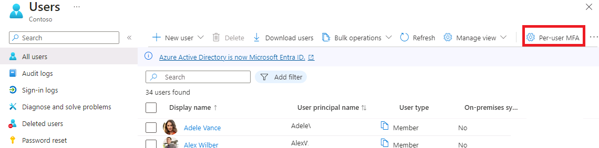

---
lab:
  title: "8\_- Activer l’authentification multifacteur Azure\_AD"
  learning path: '02'
  module: Module 02 - Implement an Authentication and Access Management Solution
---

# Labo 8 - Activer l’authentification multifacteur Azure AD

## Scénario de l’exercice

Afin de renforcer la sécurité dans votre organisation, on vous a demandé d’activer l’authentification multifacteur pour Azure Active Directory.

#### Durée estimée : 15 minutes

**IMPORTANT** - Une licence Azure AD Premium est requise pour cet exercice.

### Exercice 1 - Examiner et activer l’authentification multifacteur dans Azure

#### Tâche 1 - Examiner les options d’authentification multifacteur dans Azure

1. Accédez à [https://portal.azure.com](https://portal.azure.com) et connectez-vous à l’aide d’un compte Administrateur général pour l’annuaire.

2. Utilisez la fonctionnalité de recherche et recherchez **multifacteur**.

3. Dans les résultats de la recherche, sélectionnez **Authentification multifacteur**.

4. Sur la page de prise en main, sous **Configurer**, sélectionnez **Paramètres de MFA basé dans le cloud supplémentaires**.

    

5. Dans la nouvelle page de navigateur, vous pouvez voir les options de MFA pour les utilisateurs et les paramètres de service Azure.

    

    C’est là que vous sélectionnez les méthodes d’authentification prises en charge. Dans l’écran ci-dessus, toutes sont sélectionnées.

    Ici, vous pouvez aussi activer ou désactiver les mots de passe d’application, ce qui permet aux utilisateurs de créer des mots de passe de compte uniques pour les applications qui ne prennent pas en charge l’authentification multifacteur. Cette fonctionnalité permet à l’utilisateur de s’authentifier avec son identité Azure AD en utilisant un mot de passe différent propre à cette application.

#### Tâche 2 - Configurer des règles d’accès conditionnel pour MFA pour Delia Dennis

Nous allons maintenant examiner comment configurer des règles de stratégie d’accès conditionnel afin que les utilisateurs invités utilisent l’authentification multifacteur (MFA) pour accéder à des applications spécifiques sur votre réseau.

1. Revenez au portail Azure, puis sélectionnez **Azure Active Directory**, **Sécurité**, puis **Accès conditionnel**.

2. Dans le menu, sélectionnez **+ Nouvelle stratégie**. Dans le menu déroulant, sélectionnez **Créer une stratégie**.

    

3. Nommez votre stratégie, par exemple **MFA_pour_Delia**.

4. Sous Attributions, sélectionnez **Utilisateurs ou identités de charge de travail**.

    - Sélectionnez **0 utilisateur ou identité de charge de travail sélectionné**.  
    - Dans l’écran de droite, sélectionnez la case **Sélectionner des utilisateurs et des groupes**.
    - Sélectionnez **Utilisateurs et groupes** (les utilisateurs disponibles sont renseignés à droite).
    - Choisissez **Delia Dennis** dans la liste des utilisateurs, puis choisissez le bouton **Sélectionner**.

5. Sélectionnez **Applications ou actions cloud**.

   - Dans la liste déroulante, vérifiez que l’option **Applications cloud** est sélectionnée.
   - Sous Inclure, marquez **Toutes les applications cloud** et notez l’avertissement qui s’affiche sur votre verrouillage possible. 
   - Sous Inclure, remplacez à présent l’option par **Sélectionner des applications**.
   - Dans la nouvelle boîte de dialogue qui s’affiche, choisissez **Office 365**.
      - **Rappel** - Dans un labo précédent, nous avons octroyé à Delia Dennis une licence Office 365 et nous nous sommes connectés pour vérifier que cette licence fonctionnait.
   - Choisissez **Sélectionner**.

6. Passez en revue la section Conditions.

   - Sélectionnez **Emplacements** et choisissez **Tous les emplacements**.

7. Sous **Contrôles d’accès**, sélectionnez **Accorder** et vérifiez que l’option **Accorder l’accès** est sélectionnée.

8. Cochez la case **Exiger l’authentification multifacteur** pour appliquer MFA.

9. Vérifiez que l’option **Exiger tous les contrôles sélectionnés** est sélectionnée.

10. Cliquez sur **Sélectionner**.

11. Définissez **Activer la stratégie** sur **Activé**.

12. Appuyez sur **Créer** pour créer la stratégie.

    

    MFA est à présent activé pour l’utilisateur et les applications sélectionnés. La prochaine fois qu’un invité tentera de se connecter à cette ou ces applications, il sera invité à s’inscrire pour MFA.

#### Tâche 3 - Tester la connexion de Delia

1. Ouvrez une nouvelle fenêtre de navigation privée.
2. Se connecter à https://www.office.com.
3. Sélectionnez l’option de connexion.
4. Entrez **DeliaD@**`<<your domain address>>`.
5. Entrer le mot de passe = Entrez le mot de passe de l’administrateur général du locataire (remarque : consultez l’onglet « Ressources du labo » pour récupérer le mot de passe de l’administrateur).

**Remarque** : à ce stade, il y a deux cas de figure possibles.  Un message devrait s’afficher pour indiquer que vous devez configurer l’application Authenticator et vous inscrire à l’authentification multifacteur.  Suivez les invites pour effectuer la procédure à l’aide de votre téléphone personnel.  REMARQUE : il est possible qu’un message d’échec de la connexion s’affiche avec plusieurs options sur la procédure à suivre.  Dans ce cas, sélectionnez l’option **Réessayer**.

Vous pouvez constater qu’en raison de la règle d’accès conditionnel que nous avons créée pour Delia, l’authentification multifacteur est requise pour lancer la page d’accueil d’Office 365.

### Exercice 2 - Configurer l’authentification multifacteur pour qu’elle soit requise pour la connexion

#### Tâche 1 - Configurer l’authentification multifacteur par utilisateur dans Azure AD

Enfin, nous allons voir comment configurer MFA pour les comptes d’utilisateur. Il s’agit d’une autre façon d’accéder aux paramètres d’authentification multifacteur.

1. Revenez au tableau de bord Azure Active Directory dans le portail Azure.

2. Sélectionnez **Utilisateurs**.

3. Dans la partie supérieure du volet Utilisateurs, sélectionnez **MFA par utilisateur**.

   

4. Un nouvel onglet/fenêtre de navigateur s’ouvre avec une boîte de dialogue de paramètres utilisateur pour l’authentification multifacteur.

   Vous pouvez activer ou désactiver MFA pour chaque utilisateur en sélectionnant un utilisateur et en suivant les étapes rapides sur le côté droit.

   

5. Sélectionnez **Adele Vance** avec une coche.
6. Sélectionnez l’option **Activer** sous Étapes rapides.
7. Lisez la fenêtre contextuelle de notification si elle s’affiche, puis sélectionnez le bouton **Activer l’authentification multifacteur**.
8. Sélectionnez **Fermer**.
9. Notez que l’état de MFA pour Adele est à présent **Activé**.
10. Vous pouvez sélectionner **Paramètres de service** pour afficher l’écran des paramètres MFA, vu précédemment dans le labo.
11. Fermez l’onglet des paramètres MFA.

#### Tâche 2 - Essayer de se connecter en tant qu’Adele

1. Si vous souhaitez voir un autre exemple de processus de connexion MFA, vous pouvez essayer de vous connecter en tant qu’Adele.
