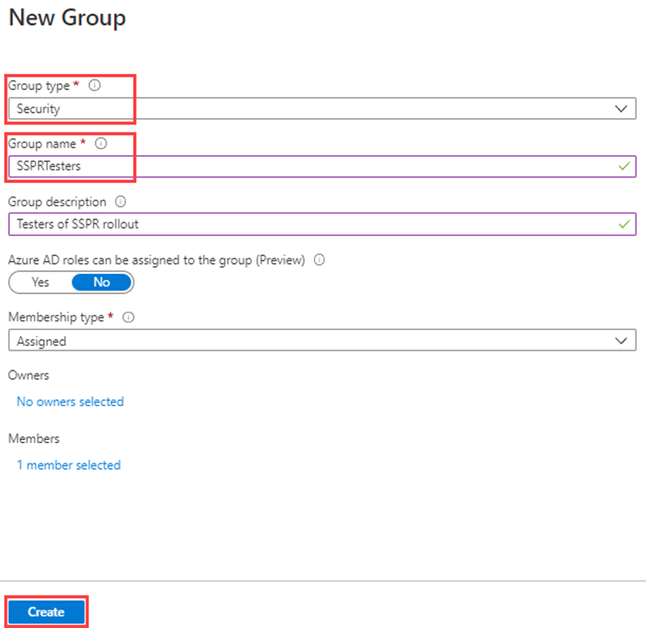
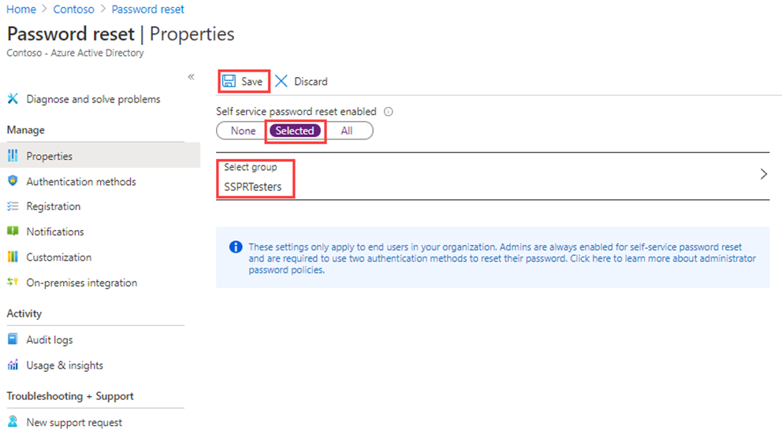
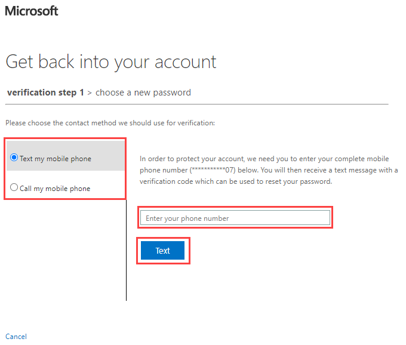

---
lab:
  title: "09\_: Activer la réinitialisation de mot de passe en libre-service Microsoft\_Entra"
  learning path: '02'
  module: Module 02 - Implement an Authentication and Access Management Solution
---

# Labo 09 : Configurer et déployer la réinitialisation de mot de passe en libre-service
## Scénario de l’exercice

L’entreprise a décidé d’autonomiser les employés et d’activer la réinitialisation de mot de passe en libre-service. Vous devez configurer ce paramètre dans votre organisation.

#### Durée estimée : 15 minutes

### Exercice 1 : Créer un groupe avec SSPR activé et ajouter des utilisateurs à celui-ci

#### Tâche 1 : créer un groupe pour affecter SSPR à

Vous voulez d’abord déployer SSPR sur un ensemble limité d’utilisateurs pour vérifier que votre configuration SSPR fonctionne comme prévu. Nous allons créer un groupe de sécurité pour le déploiement limité et ajouter un utilisateur au groupe.

1. Dans le centre d’administration Microsoft Entra, ouvrez le menu de navigation **Identité** sur la gauche.
1. Sous **Groupes**, sélectionnez **Tous les groupes**, puis **Nouveau groupe** dans la fenêtre de droite.

2. Créez un nouveau groupe à l’aide des informations suivantes :

    | **Paramètre**| **Valeur**|
    | :--- | :--- |
    | Type de groupe| Sécurité|
    | Nom du groupe| SSPRTesters|
    | Description du groupe| Testeurs du déploiement de SSPR|
    | Type d’appartenance| Attribué|
    | Membres| Alex Wilber |
    | |  Allan Deyoung |
    | | Bianca Pisani |
  
    
3. Sélectionnez  **Créer**.

    

#### Tâche 2 : activer SSPR pour vous groupe de tests

Activez SSPR pour le groupe.

1. Revenez au menu de navigation **Identité**.

2. Sous  **Protection**, sélectionnez  **Réinitialisation du mot de passe**.

3. Sur la page Propriétés du panneau de réinitialisation du mot de passe, sous **Réinitialisation du mot de passe en libre-service activée**, choisissez  **Sélectionné**.

4. Sélectionnez **Sélectionner un groupe** et choisissez **SSPRSecurityGroupUser**.

5. Dans le volet Stratégie de réinitialisation de mot de passe par défaut, sélectionnez le groupe **SSPRTesters** .

6. Sur la page Réinitialisation du mot de passe de la page Propriétés, sélectionnez  **Enregistrer**.

    

7. Sur l’écran de **réinitialisation du mot de passe**, regardez sous  **Gérer* **, sélectionnez et passez en revue les valeurs par défaut pour chacune des méthodes d’authentification, ** **inscription**, **notifications** et paramètres de **personnalisation**.

    **Notez** qu’il est important d’avoir **un téléphone** sélectionné comme l’une des méthodes d’authentification pour le reste de ce labo, même si vous pouvez également avoir d’autres options.

#### Tâche 3 : s’inscrire à SSPR avec Alex

Maintenant que la configuration SSPR est terminée, inscrivez un numéro de téléphone mobile pour l’utilisateur que vous avez créé.

1. Ouvrez un autre navigateur ou ouvrez une session de navigateur InPrivate ou Incognito, puis accédez à [https://aka.ms/ssprsetup](https://aka.ms/ssprsetup).

    Cela permet de s’assurer que vous serez invité à vous authentifier comme utilisateur.

2. Connectez-vous en tant que **AlexW@**`<<organization-domain-name>>.onmicrosoft.com`, avec le mot de passe : entrez le mot de passe administrateur général du locataire (reportez-vous à l’onglet Ressources du labo pour récupérer le mot de passe d’administrateur).

    **Remarque :** remplacez nom de domaine de l’organisation par votre nom de domaine.

3. Lorsque vous êtes invité(e) à mettre à jour votre mot de passe, entrez un nouveau mot de passe de votre choix. Veillez à enregistrer le nouveau mot de passe.

4. Dans la boîte de dialogue **Informations supplémentaires requises** , sélectionnez **Suivant**.

5. Sur la page Conserver la sécurité de votre compte, vous pouvez utiliser l’option **Téléphone**.

    

    **Remarque** : dans ce labo, vous allez utiliser l’option **Téléphone**. Entrez les détails de votre téléphone mobile.

6. Entrez votre numéro de téléphone cellulaire personnel dans le champ numéro de téléphone.
7. Sélectionnez  **M’envoyer un code par SMS**.
8. Cliquez sur **Suivant**.

9. Quand vous recevez le code sur votre téléphone mobile, entrez-le dans la zone de texte et sélectionnez **Suivant**.

10. Une fois votre téléphone inscrit, sélectionnez **Suivant**, puis sélectionnez **Terminé**.

11. Fermez le navigateur. Vous n’avez pas besoin de terminer le processus de connexion.

#### Tâche 4 : Tester SSPR

Vérifions maintenant si l’utilisateur peut réinitialiser son mot de passe.

1. Ouvrez un autre navigateur ou ouvrez une session de navigateur InPrivate ou Incognito, puis accédez à  [https://portal.azure.com](https://portal.azure.com).

    Cela permet de s’assurer que vous serez invité à vous authentifier comme utilisateur.

2. Saisissez **AlexW@**`<<organization-domain-name>>.onmicrosoft.com`, puis sélectionnez **Suivant**.

    **Remarque :** remplacez nom de domaine de l’organisation par votre nom de domaine.

3. Dans l’écran Saisie du mot de passe, sélectionnez **Mot de passe oublié**.

4. Dans la page Récupérer dans votre compte, renseignez les informations demandées, puis sélectionnez **Suivant**.

    

5. Dans la tâche **Étape de vérification 1**, sélectionnez **M’envoyer un SMS**, entrez votre numéro de téléphone, puis sélectionnez **SMS**.

    

6. Entrez votre code de vérification, puis sélectionnez **Suivant**.

7. Dans l’étape Choisir un nouveau mot de passe, entrez puis confirmez votre nouveau mot de passe.  Recommander le mot de passe :**Pass@w.rd1234**.

8. Lorsque vous avez terminé, sélectionnez **Terminer**.

9. Connectez-vous en tant que **AlexW** avec le mot de passe que vous avez créé.

10. Entrez votre code de vérification, puis vérifiez que vous pouvez terminer le processus de connexion.

11. Lorsque vous avez terminé, fermez votre navigateur.

#### Tâche 5 : que se passe-t-il si vous essayez un utilisateur qui ne figure pas dans le groupe SSPRTesters ?

1. En guise de test, ouvrez une nouvelle fenêtre de navigateur InPrivate et essayez de vous connecter au Portail Azure en tant que GradyA, puis sélectionnez l’option **Mot de passe oublié**.
