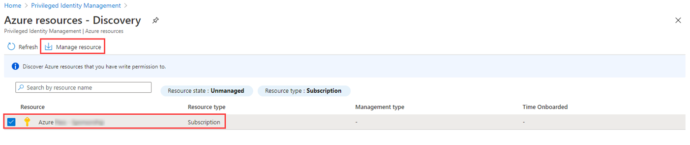

---
lab:
  title: "11\_- Attribuer des rôles de ressources Azure dans Privileged\_Identity\_Management"
  learning path: '02'
  module: Module 02 - Implement an authentication and access management solution
---

# Labo 11 - Attribuer des rôles de ressources Azure dans Privileged Identity Management

**Remarque** : ce labo nécessite un pass Azure. Consultez le labo 00 pour obtenir des instructions.

## Scénario de l’exercice

Azure Active Directory (Azure AD) Privileged Identity Management (PIM) peut gérer les rôles de ressources intégrés d’Azure, ainsi que les rôles personnalisés, notamment (liste non exhaustive) :

- Propriétaire
- Administrateur de l'accès utilisateur
- Contributeur
- Administrateur de la sécurité
- Gestionnaire de sécurité

Vous devez rendre un utilisateur éligible pour un rôle de ressource Azure.

#### Durée estimée : 10 minutes

### Exercice 1 - PIM avec des ressources Azure

#### Tâche 1 - Attribuer un rôle de ressource Azure

1. Connectez-vous à l’adresse [https://portal.azure.com](https://portal.azure.com) à l’aide d’un compte Administrateur général.

2. Recherchez, puis sélectionnez **Azure AD Privileged Identity Management.**

3. Dans le volet de navigation de gauche de la page Privileged Identity Management, sélectionnez **Ressources Azure**.

4. Dans le menu supérieur, sélectionnez **Découvrir les ressources**.

5. Sur la page Ressources Azure - Découverte, sélectionnez votre abonnement, puis, dans le menu supérieur, sélectionnez **Gérer les ressources**.

   

6. Dans la boîte de dialogue **Intégration de la ressource sélectionnée pour la gestion**, passez en revue les informations, puis sélectionnez **OK**.

7. Une fois l’intégration terminée, fermez la page Ressources Azure - Découverte.

8. Sur la page des ressources Azure, sélectionnez l’abonnement souhaité.

   

9. Dans le menu de navigation de gauche, sous **Gérer**, sélectionnez **Rôles** pour afficher la liste des rôles pour les ressources Azure.

10. Dans le menu du haut, sélectionnez **+Ajouter des affectations.**

11. Sur la page Ajouter des attributions, sélectionnez le menu **Sélectionner un rôle**, puis **Contributeur de services de gestion d’API**.

12. Sous **Sélectionner des membres**, sélectionnez **Aucun membre sélectionné**.

13. Sélectionnez le membre **Miriam Graham** de votre organisation pour l’attribuer au rôle.  Choisissez ensuite **Sélectionner**.

14. Cliquez sur **Suivant**.

15. Dans l'onglet **Paramètres**, sous **Type d'affectation**, sélectionnez **Éligible**.

   - Les attributions **éligibles** exigent des membres qu’ils effectuent une action pour utiliser ce rôle. Il peut s’agir de procéder à une vérification de l’authentification multifacteur (MFA), de fournir une justification professionnelle ou de demander une approbation aux approbateurs désignés.

   - Les attributions de membres **actifs** n’exigent pas des membres qu’ils effectuent une action pour utiliser ce rôle. Les membres actifs disposent en permanence des privilèges affectés au rôle.

16. Spécifiez une durée d’attribution en modifiant les dates et heures de début et de fin.

17. Lorsque vous avez terminé, sélectionnez **Attribuer**.

18. Une fois la nouvelle attribution de rôle créée, une notification d’état s’affiche.

#### Tâche 2 - Mettre à jour ou supprimer une attribution de rôle de ressource existante

Suivez ces étapes pour mettre à jour ou supprimer une attribution de rôle existante.

1. Ouvrez **Azure AD Privileged Identity Management**.

2. Sélectionnez **Ressources Azure**.

3. Sélectionnez l’abonnement que vous souhaitez gérer pour ouvrir sa page de vue d’ensemble.

4. Sous **Gérer**, sélectionnez **Attributions**.

5. Sous l’onglet **rôles éligibles** , dans la colonne action, passez en revue les options disponibles.

6. Sélectionnez **Supprimer**.

7. Dans la boîte de dialogue **Supprimer**, passez en revue les informations, puis sélectionnez **Oui**.
