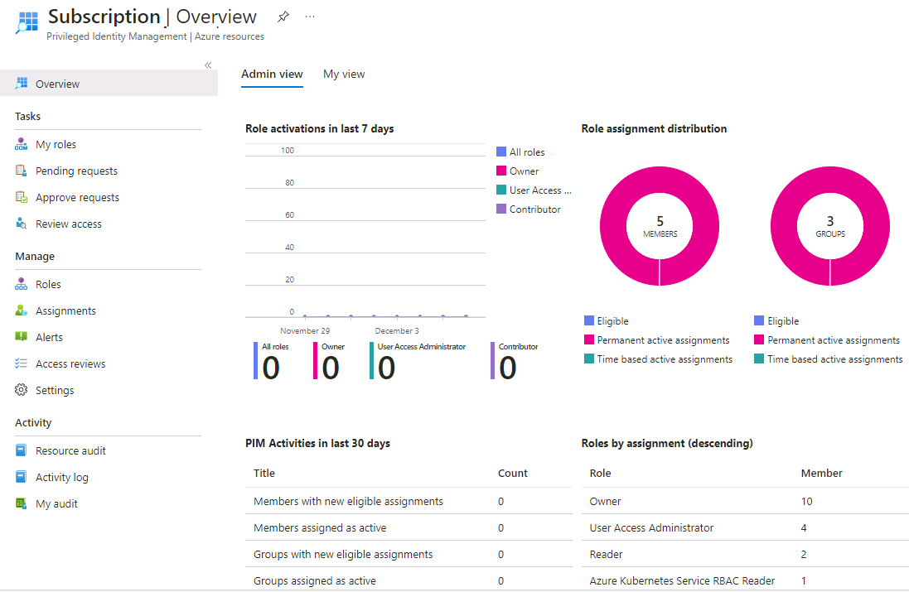

---
lab:
  title: "11\_: Attribuer des rôles de ressources Azure dans Privileged Identity Management"
  learning path: '02'
  module: Module 02 - Implement an authentication and access management solution
---

# Labo 11 : Attribuer des rôles de ressources Azure dans Privileged Identity Management

### Type de connexion = Connexion à la ressource Azure

## Scénario de labo

Microsoft Entra Privileged Identity Management (PIM) peut gérer les rôles de ressources intégrés Azure, ainsi que les rôles personnalisés, notamment (liste non exhaustive) :

- Propriétaire
- Administrateur de l'accès utilisateur
- Contributeur
- Administrateur de la sécurité
- Gestionnaire de sécurité

Vous devez rendre un utilisateur éligible pour un rôle de ressource Azure.

#### Durée estimée : 10 minutes

### Exercice 1 : PIM avec des ressources Azure

#### Tâche 1 : attribuer des rôles de ressources Azure

1. Connectez-vous sur [https://entra.microsoft.com](https://entra.microsoft.com) à l’aide du compte Administrateur fourni.

2. Recherchez, puis sélectionnez **Microsoft Entra Privileged Identity Management.**

3. Sur la page Privileged Identity Management du volet de navigation de gauche, sélectionnez **Ressources Azure**.

**Conseil du labo** : les étapes suivantes sont écrites pour l’expérience de ressource Azure héritée.  Vous pouvez basculer vers l’ancienne expérience en haut de votre écran. Vous pouvez également effectuer l’exercice dans la nouvelle expérience sans l’étape par étape.

4. Dans la liste déroulante Abonnements, choisissez l’élément Abonnement MOC #####. Ensuite, en bas de l’écran, sélectionnez **Gérer les ressources**.

5. Dans la page Ressources Azure : Détection, sélectionnez votre abonnement.

6. Sur la page **Vue d’ensemble**, passez en revue les informations.

   

   **Conseil pour le labo** : en raison de la nature de l’environnement de labo, vous ne verrez aucune ressource. Reportez-vous à l’image d’un exemple.

7. Dans le menu de navigation de gauche, sous **Gérer**, sélectionnez **Rôles** pour afficher la liste des rôles pour les ressources Azure.

8. Dans le menu du haut, sélectionnez **+Ajouter des affectations.**

9. Sur la page Ajouter des attributions, sélectionnez le menu **Sélectionner un rôle**, puis **Contributeur du service Gestion des API**.

10. Sous **Sélectionner des membres**, sélectionnez **Aucun membre sélectionné**.

11. Dans le volet Sélectionner un membre ou un groupe, recherchez vos rôles d’administrateur **User1-######@LODSPRODMCA.onmicrosoft.com** de votre organisation qui se verront attribuer le rôle.  Sélectionnez ensuite ****.

12. Cliquez sur **Suivant**.

13. Dans l'onglet **Paramètres**, sous **Type d'affectation**, sélectionnez **Éligible**.

   - Les attributions **éligibles** exigent des membres qu’ils effectuent une action pour utiliser ce rôle. Il peut s’agir de procéder à une vérification de l’authentification multifacteur (MFA), de fournir une justification professionnelle ou de demander une approbation aux approbateurs désignés.

   - Les attributions de membres **actifs** n’exigent pas des membres qu’ils effectuent une action pour utiliser ce rôle. Les membres actifs disposent en permanence des privilèges affectés au rôle.

14. Spécifiez une durée d’attribution en modifiant les dates et heures de début et de fin.

15. Lorsque vous avez terminé, sélectionnez **Attribuer**.

16. Une fois la nouvelle attribution de rôle créée, une notification d’état s’affiche.

#### Tâche 2 : mettre à jour ou supprimer une attribution de rôle existante

**Note** : en raison de la sécurité appliquée à cet environnement de labo, vous ne pouvez pas effectuer ces étapes.  Passez en revue les étapes de l’interface utilisateur, mais vous ne pourrez pas appliquer de modifications.  Nous recherchons activement des solutions alternatives.

Suivez ces étapes pour mettre à jour ou supprimer une attribution de rôle existante.

1. Ouvrez **Microsoft Entra Privileged Identity Management**.

2. Sélectionnez **Ressources Azure**.

3. Sélectionnez l’abonnement que vous souhaitez gérer pour ouvrir sa page de vue d’ensemble.

4. Sous **Gérer**, sélectionnez **Attributions**.

5. Dans l’onglet **Rôles éligibles**, dans la colonne action, passez en revue les options disponibles.

6. Sélectionnez **Supprimer**.

7. Dans la boîte de dialogue **Supprimer**, passez en revue les informations, puis sélectionnez **Oui**.
