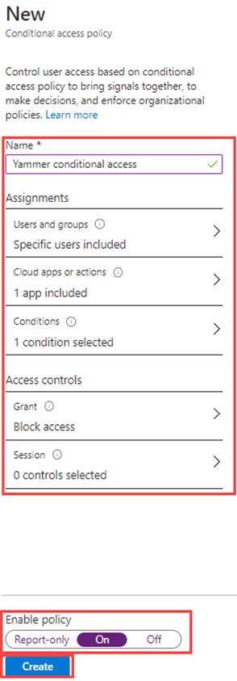

---
lab:
  title: "13\_: Implémenter et tester une stratégie d’accès conditionnel"
  learning path: '02'
  module: Module 02 - Implement an Authentication and Access Management Solution
---

# Labo 13 : Implémenter et tester une stratégie d’accès conditionnel

### Type de connexion = Administrateur Microsoft 365

## Scénario de labo

Votre organisation doit pouvoir limiter l’accès utilisateur à ses applications internes. Vous devez déployer une stratégie d’accès conditionnel Microsoft Entra.

**Remarque** : pour les stratégies d’accès conditionnel, vous pouvez désactiver les valeurs par défaut de sécurité, puisque les points clés à mémoriser proviennent de la formation.  Vous trouverez des informations supplémentaires sur les valeurs par défaut de sécurité en suivant ce lien : <https://docs.microsoft.com/en-us/azure/active-directory/fundamentals/concept-fundamentals-security-defaults>

#### Durée estimée : 20 minutes

### Exercice 1 : Définir une stratégie d’accès conditionnel pour empêcher DebraB d’accéder à Sway

#### Tâche 1 : Vérifier que DebraB a accès à Sway

1. Lancez une nouvelle fenêtre de navigateur InPrivate.
2. Connectez-vous à [https://www.office.com](https://www.office.com) 
3. Lorsque l’invite s’ouvre, connectez-vous en tant que DebraB :

  | Paramètre | Valeur |
  | :--- | :--- |
  | Nom d’utilisateur | **DebraB@**`<<your lab domain>>.onmicrosoft.com` |
  | Mot de passe | Entrez le mot de passe administrateur du locataire (reportez-vous à l’onglet Ressources du labo pour récupérer le mot de passe d’administrateur du locataire). |
    
4. Ignorez les écrans d’accueil et d’introduction.

5. Ouvrez la page **Applications**, puis sélectionnez l’icône **Sway** pour voir qu’elle se charge correctement.

6. Déconnectez-vous d’Office et fermez votre session de navigateur.

#### Tâche 2 : créer une stratégie d’accès conditionnel.

L’accès conditionnel Microsoft Entra est une fonctionnalité avancée de Microsoft Entra ID vous permettant de spécifier des stratégies détaillées qui contrôlent les utilisateurs pouvant accéder à vos ressources. Avec l’accès conditionnel, vous pouvez protéger vos applications en limitant l’accès des utilisateurs en fonction d’éléments tels que les groupes, le type d’appareil, l’emplacement et le rôle.

1. Accédez au [https://entra.microsoft.com](https://entra.microsoft.com) et connectez-vous à l’aide d’un compte d’administrateur général pour le répertoire.

2. Ouvrez le menu du portail, puis sélectionnez  **Microsoft Entra ID**.

3. Dans le menu **Identité**, sélectionnez **Protection**.

4. Sur la page Sécurité, dans le volet de navigation de gauche, sélectionnez **Accès conditionnel**.

5. Dans la **vue d’ensemble (préversion)**, cliquez sur **+ Créer une stratégie**.

   

6. Dans le champ **Nom**, saisissez **Bloquer Sway pour DebraB**.

   **Remarque** : utilisez cette dénomination pour vous aider à reconnaître rapidement la stratégie et sa fonction.

7. Sous **Affectations**, sélectionnez **Aucun utilisateur et groupe sélectionné**.

8. Dans l’onglet Inclure, choisissez **Sélectionner des utilisateurs et des groupes**, puis cochez la case **Utilisateurs et des groupes**.

9. Dans le volet Sélectionner, choisissez le compte **DebraB**, puis **Sélectionner**.

10. Dans **Ressources cibles**, sélectionnez **Aucune ressource cible sélectionnée**.

11. Vérifiez que **les applications cloud** sont sélectionnées, choisissez **Sélectionner des applications**, puis choisissez **Aucun** dans la section Sélectionner.

12. Dans le volet Sélectionner, recherchez **Sway**, sélectionnez **Sway**, puis choisissez **Sélectionner**.

13. Sous **Contrôles des accès** trouvez la section **Accorder**, et sélectionnez **Aucun contrôle sélectionné**.

14. Dans le volet Accorder, sélectionnez **Bloquer l’accès**, puis sélectionnez **Sélectionner**.

   **Remarque** :cette stratégie est configurée pour l’exercice uniquement et est utilisée pour démontrer rapidement une stratégie d’accès conditionnel.

15. Sous **Activer la stratégie**, sélectionnez **Activé**, puis sélectionnez **Créer**.

   

#### Tâche 3 : tester la stratégie d’accès conditionnel

Vous devez tester vos stratégies d’accès conditionnel pour vous assurer qu’elles fonctionnent comme prévu.

1. Ouvrez un nouvel onglet de navigateur, puis accédez au [https://sway.office.com](https://sway.office.com).
    - Lorsque l’invite s’ouvre, connectez-vous en tant que DebraB :

   | Paramètre | Valeur |
   | :--- | :--- |
   | Nom d’utilisateur | **DebraB@**`<<your lab domain>>.onmicrosoft.com` |
   | Mot de passe | Entrez le mot de passe administrateur du locataire (reportez-vous à l’onglet Ressources du labo pour récupérer le mot de passe d’administrateur du locataire). |
     
2. Vérifiez que vous ne pouvez pas accéder à Microsoft Sway.

   

3. Si vous êtes connecté(e), fermez l’onglet, attendez 1 minute, puis réessayez.
    
   **Remarque** : si vous êtes connecté automatiquement à Sway en tant que DebraB, vous devrez vous déconnecter manuellement.  Vos informations d’identification/votre accès ont été mis en cache.  Après vous être déconnecter, puis connecter, votre session Sway doit refuser l’accès.

4. Fermez l’onglet et revenez à la page Accès conditionnel.

5. Sélectionnez la stratégie **Bloquer Sway pour DebraB** .

6. Sous **Activer la stratégie**, sélectionnez **Désactivé**, puis sélectionnez **Enregistrer**.

### Exercice 2 : Tester les stratégies d’accès conditionnel avec « What if »

#### Vidéo : Utiliser la fonctionnalité « what if » pour tester les stratégies d’accès conditionnel

1. Ouvrez le menu du centre d’administration Microsoft Entra, puis sélectionnez  **Microsoft Entra ID**.

1. Dans le menu **Identité**, sélectionnez **Protection**.

1. Sur la page Sécurité, dans le volet de navigation de gauche, sélectionnez **Accès conditionnel**.

1. Dans le volet de navigation, cliquez sur **Stratégies**.

1. Sélectionnez **What if**.

1. Sous **Identité utilisateur ou charge de travail**, sélectionnez **Aucun utilisateur ou principal de service sélectionné**.

1. Choisissez **DebraB** en tant qu’utilisateur.

1. Sous **Applications cloud, actions ou contexte d’authentification**, sélectionnez **Sway**. 

1. Sélectionnez **What if**. Vous recevrez un rapport en bas de la vignette pour les **stratégies qui s’appliqueront** et les **stratégies qui ne s’appliqueront** pas.

Cela vous permet de tester les stratégies et leur affectivité avant de les activer.

### Configurer des contrôles de fréquence de connexion à l’aide d’une stratégie d’accès conditionnel

#### À partir du centre d’administration Microsoft Entra, configurez l’accès conditionnel.

Dans le cadre de la configuration d’une sécurité renforcée de votre entreprise, vous devez tester une stratégie d’accès conditionnel qui peut être utilisée pour contrôler la fréquence de connexion.

1. Accédez au [https://entra.microsoft.com](https://entra.microsoft.com) et connectez-vous à l’aide d’un compte d’administrateur général pour le répertoire.

2. Ouvrez le menu du portail, puis sélectionnez  **Microsoft Entra ID**.

3. Dans le menu **Identité**, sélectionnez **Protection**.

4. Dans le menu Protection, dans le volet de navigation de gauche, sélectionnez **Accès conditionnel**.

5. Dans le menu du haut, sélectionnez **+ Nouvelle stratégie**. Dans le menu déroulant, sélectionnez **+ Créer une stratégie**.

   

6. Dans la zone **Nom**, entrez **Fréquence de connexion**.

7. Sous **Affectations**, sélectionnez **Aucun utilisateur et groupe sélectionné**.

8. Dans l’onglet Inclure, cochez les cases **Sélectionner des utilisateurs et des groupes** et **Utilisateurs et des groupes**.

9. Dans le volet Sélectionner, sélectionnez votre compte **Grady Archie**, puis sélectionnez **Sélectionner**.

10. Sélectionnez **Ressources cibles - Aucune ressource cible sélectionnée**.

11. Dans l’élément **Inclure**, vérifiez que **Sélectionner les ressources** est sélectionné, puis sélectionnez **Aucun** dans la section Sélectionner.

12. Dans le volet Sélectionner, sélectionnez **Office 365**, puis sélectionnez **Sélectionner**.

13. Sous **Contrôles d’accès**, sélectionnez **Session**.

14. Dans le volet Session, sélectionnez **Fréquence de connexion**.

15. Dans la zone de valeur, entrez **30**.

16. Sélectionnez le menu des unités, sélectionnez **Jours**, puis sélectionnez **Sélectionner**.

17. Sous **Activer la stratégie**, sélectionnez **Rapport uniquement**, puis sélectionnez **Créer**.

   

   **REMARQUE** : le mode rapport seul est un nouvel état de la stratégie d’accès conditionnel qui permet aux administrateurs d’évaluer l’impact des stratégies d’accès conditionnel avant de les activer dans leur environnement. Avec la mise en production du mode rapport seul :
    
- Il est possible d’activer les stratégies d’accès conditionnel en mode rapport seul.
- Lors de la connexion, les stratégies en mode rapport seul sont évaluées, mais non appliquées.
- Les résultats sont journalisés dans les onglets Accès conditionnel et Rapport seul des détails du journal de connexion.
- Les clients disposant d’un abonnement Azure Monitor peuvent surveiller l’impact de leurs stratégies d’accès conditionnel dans le classeur Insights sur l’accès conditionnel.
