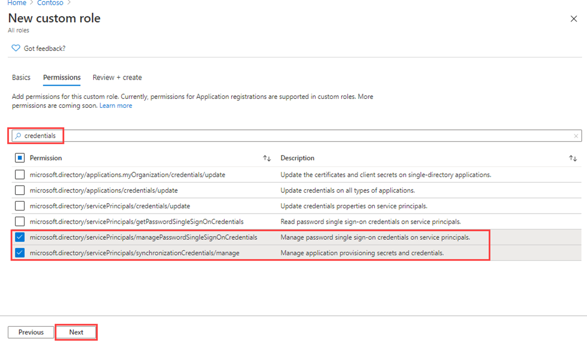

---
lab:
  title: 19 - Inscrire une application
  learning path: '03'
  module: Module 03 - Implement Access Management for Apps
---

# Labo 19 : Inscrire une application

### Type de connexion = Administrateur Microsoft 365

#### Durée estimée : 30 minutes

### Exercice 1 : Inscrire une application

#### Tâche 1 : inscrire une application

L’inscription de votre application établit une relation d’approbation entre votre application et la plateforme d’identités Microsoft. L’approbation est unidirectionnelle : votre application approuve la plateforme d’identités Microsoft, et non le contraire.

1. Connectez-vous sur [https://entra.microsoft.com](https://entra.microsoft.com) à l’aide du compte Administrateur fourni.

2. Ouvrez le menu du portail, puis sélectionnez  **Microsoft Entra ID**.

3. Dans le menu **Identité**, sous **Applications**, sélectionnez **Inscriptions d’applications.**

4. Dans la page **Inscriptions d’applications**, dans le menu, sélectionnez **+ Nouvelle inscription**.

5. Dans le panneau **Inscrire une application**, inscrivez une application nommée **Demo App** en utilisant les valeurs par défaut. Vous n’avez pas besoin d’entrer l’URI de redirection.

    

6. Sélectionnez le bouton **S’inscrire**.

7. Une fois terminé, vous serez redirigé vers la page **Application de démonstration**.

#### Tâche 2 : configurer les paramètres de plateforme

Les paramètres de chaque type d’application, y compris les URI de redirection, sont configurés dans  **Configurations de plateforme**  dans le Portail Azure. Certaines plateformes, comme les  **applications web**  et les  **applications monopages**, nécessitent de spécifier manuellement un URI de redirection. Pour les autres plateformes, comme les plateformes mobiles et de bureau, vous pouvez sélectionner des URI de redirection générés automatiquement quand vous configurez leurs autres paramètres.

Pour configurer des paramètres d’application en fonction de la plateforme ou de l’appareil ciblé :

Pour ajouter et modifier des URI de redirection pour vos applications inscrites, vous devez configurer leurs paramètres de plateforme.

1. Sélectionnez votre application dans les  **Inscriptions d’applications** dans le centre d’administration Microsoft Entra.

2. Sous  **Gérer**, sélectionnez  **Authentification**.

3. Sous  **Configurations de plateformes**, sélectionnez  **+ Ajouter une plateforme**.

4. Dans  **Configurer des plateformes**, sélectionnez la vignette correspondant à votre type d’application (plateforme) pour configurer ses paramètres.

    

    | Plateforme| Paramètres de configuration|
    | :--- | :--- |
    | web| Saisissez un  **URI de redirection**  pour votre application, qui est l’emplacement où la plateforme d’identités Microsoft redirige le client d’un utilisateur et envoie des jetons de sécurité après authentification. Sélectionnez cette plateforme pour les applications web standard qui s’exécutent sur un serveur.|
    | Application monopage| Saisissez un  **URI de redirection**  pour votre application, qui est l’emplacement où la plateforme d’identités Microsoft redirige le client d’un utilisateur et envoie des jetons de sécurité après authentification. Sélectionnez cette plateforme si vous générez une application web côté client dans JavaScript ou avec un framework comme Angular, Vue.js, React.js ou Blazor WebAssembly.|
    | iOS/macOS| Entrez l’ **ID de bundle** de l’application, qui se trouve dans Xcode dans  *Info.plist*  ou Paramètres de build. Un URI de redirection est automatiquement généré quand vous spécifiez un ID de bundle.|
    | Android| Entrez le  **Nom du package** de l’application, que vous trouverez dans le fichier AndroidManifest.xml. Générez et saisissez ensuite le  **code de hachage signature**. Un URI de redirection est automatiquement généré quand vous spécifiez ces paramètres.|
    | Applications de bureau et mobiles| Sélectionnez l’un des  **URI de redirection suggérés**  ou spécifiez un  **URI de redirection personnalisé**. Pour les applications de bureau, nous recommandons [https://login.microsoftonline.com/common/oauth2/nativeclient](https://login.microsoftonline.com/common/oauth2/nativeclient). Sélectionnez cette plateforme pour les applications mobiles qui n’utilisent pas la dernière bibliothèque d’authentification Microsoft (MSAL) ou qui n’utilisent pas de répartiteur. Sélectionnez également cette plateforme pour les applications de bureau.|

5. Sélectionnez **Web** comme plateforme.

6. Entrez `https://localhost` pour l’URI de redirection.

7. Sélectionnez  **Configurer**  pour effectuer la configuration de la plateforme.

#### Tâche 3 : ajouter des informations d’identification, un certificat et une clé secrète client

Les informations d’identification sont utilisées par les applications clientes confidentielles qui accèdent à une API web. Les applications web, les autres API web ou les applications de type service et démon sont des exemples de clients confidentiels. Les informations d’identification permettent à votre application de s’authentifier de façon autonome, sans qu’aucune interaction utilisateur ne soit nécessaire au moment de l’exécution.

Vous pouvez ajouter des certificats et des secrets clients (une chaîne) en tant qu’informations d’identification à votre inscription d’application cliente confidentielle.


    **Note**: Sometimes called a *public key*, certificates are the recommended credential type, because as they provide a higher level of assurance than a client secret. When using a trusted public certificate, you can add the certificate using the Certificates & secrets feature. Your certificate must be one of the following file types: .cer, .pem, .crt.


    **Note**: The client secret, also known as an *application password*, is a string value your app can use in place of a certificate to identity itself. It's the easier of the two credential types to use. It's often used during development, but is considered less secure than a certificate. You should use certificates in your applications running in production.

1. Sélectionnez votre application dans les  **Inscriptions d’applications**  du Portail Azure.

2. Sélectionnez  **Certificats et secrets**, puis  **+ Nouvelle clé secrète client**.

3. Ajoutez une description pour votre clé secrète client et la durée.

 - Description = Secret lab SC300
 - Durée = 90 jours (3 mois)

4. Sélectionnez **Ajouter**.

5. **Enregistrez la valeur du secret dans le Bloc-notes** , en vue d’une utilisation dans le code de votre application cliente. La page Certificat et Clés secrètes affiche la nouvelle valeur secrète. Il est important que vous copiiez cette valeur, car elle n’est affichée qu’une seule fois. Si vous actualisez la page et que vous y êtes revenez, elle s’affiche uniquement sous forme de valeur masquée.

Une fois votre application web inscrite, vous êtes prêt à ajouter les étendues que le code de votre API peut utiliser pour fournir une autorisation précise aux consommateurs de cette dernière.

#### Étape 5 : ajouter une étendue

Le code d’une application cliente demande l’autorisation d’effectuer des opérations définies par votre API web en transmettant un jeton d’accès avec ses demandes à la ressource protégée (l’API web). Votre API web effectue ensuite l’opération demandée uniquement si le jeton d’accès qu’elle reçoit contient les étendues (également appelées « autorisations d’application ») requises pour l’opération.

Tout d’abord, effectuez les étapes suivantes pour créer un exemple d’étendue nommé « Employees.Read.All » :

1. Sélectionnez  **Identité**, puis **Applications**  et enfin  **Inscriptions d’application**, puis sélectionnez l’inscription de votre application d’API.

2. Sélectionnez  **Exposer une API**, puis  **+ Ajouter une étendue**.

    

3. Vous êtes invité à définir un  **URI d’ID d’application**. Définissez la valeur sur **api://DemoAppAPI**.

  - Remarque : l’URI d’ID d’application, qui doit être globalement unique, fait office de préfixe pour les étendues que vous référencerez dans le code de votre API. Vous pouvez utiliser la valeur par défaut fournie, qui se présente sous la forme api://<application-client-id\>, ou spécifier un URI plus lisible comme  `https://contoso.com/api`.

4. Sélectionnez **Enregistrer et continuer**.

5. Spécifiez ensuite les attributs de l’étendue dans le volet  **Ajouter une étendue**. Pour cette procédure pas à pas, utilisez les valeurs de la 3ème colonne : **Valeur**.

    | Champ| Description| active |
    | :--- | :--- | :--- |
    | Nom de l'étendue| Nom de votre étendue. Une convention d’affectation de noms d’étendue courante est resource.operation.constraint.| Employees.Read.All|
    | Qui peut donner son consentement| Indique si cette étendue peut être consentie par des utilisateurs ou si le consentement d’un administrateur est nécessaire. Sélectionnez administrateurs uniquement pour des autorisations à privilèges élevés.| Administrateurs et utilisateurs|
    | Nom d’affichage du consentement administrateur| Courte description de l’objectif de l’étendue que seuls les administrateurs verront.| Accès en lecture seule aux enregistrements des employés|
    | Description du consentement de l'administrateur| Description plus détaillée de l’autorisation accordée par l’étendue que seuls les administrateurs verront.| Autorisez l’application à avoir un accès en lecture seule à toutes les données de l’employé.|
    | Nom d'affichage du consentement de l'utilisateur| Courte description de l’objectif de l’étendue. Affichée aux utilisateurs uniquement si vous définissez Qui peut donner son consentement sur Administrateurs et utilisateurs.| Accès en lecture seule à vos enregistrements sur les employés|
    | Description du consentement de l'utilisateur| Description plus détaillée de l’autorisation accordée par l’étendue. Affichée aux utilisateurs uniquement si vous définissez Qui peut donner son consentement sur Administrateurs et utilisateurs.| Autorisez l’application à avoir un accès en lecture seule à vos données sur l’employé.|

7. Définissez le  **Statut**  sur  **Activé**, puis sélectionnez  **Ajouter une étendue**.

8. (Facultatif) Pour supprimer les demandes de consentement des utilisateurs de votre application pour les étendues que vous avez définies, vous pouvez  *préautoriser*  l’application cliente à accéder à votre API web. Préautorisez  *uniquement*  les applications clientes que vous approuvez, car vos utilisateurs n’auront pas la possibilité de refuser le consentement.

   1. Sous  **Applications clientes autorisées**, sélectionnez  **Ajouter une application cliente.**

   2. Entrez l’ **ID d’application (client)**  de l’application cliente que vous souhaitez préautoriser, par exemple celui d’une application web que vous avez inscrite précédemment.

   3. Sous  **Étendues autorisées**, sélectionnez les étendues pour lesquelles vous souhaitez supprimer les invites de consentement, puis sélectionnez  **Ajouter une application**.

   4. Si vous avez effectué cette étape facultative, l’application cliente est désormais une application cliente préautorisée, et les utilisateurs ne sont pas invités à donner leur consentement quand ils s’y connectent.

#### Tâche 6 : ajouter une étendue nécessitant un consentement administrateur

Ajoutez ensuite un autre exemple d’étendue nommé « Employees.Write.All » auquel seuls les administrateurs peuvent donner leur consentement. Les étendues qui nécessitent le consentement de l’administrateur sont généralement utilisées pour fournir l’accès à des opérations avec des privilèges plus élevés, et souvent par des applications clientes qui s’exécutent en tant que services back-end ou en tant que démons qui ne connectent pas un utilisateur de manière interactive.

1. Pour ajouter l’exemple d’étendue « Employees.Write.All », effectuez les étapes décrites ci-dessus, puis spécifiez ces valeurs dans le volet  **Ajouter une étendue**  :

    | Champ| Exemple de valeur|
    | :--- | :--- |
    | Nom de l’étendue| Employees.Write.All|
    | Qui peut donner son consentement| Administrateurs uniquement|
    | Nom d'affichage du consentement administrateur| Accès en écriture aux enregistrements des employés|
    | Description du consentement de l'administrateur| Autorisez l’application à avoir un accès en écriture à toutes les données de l’employé.|
    | Nom d'affichage du consentement de l'utilisateur| Aucune (laisser vide)|
    | Description du consentement de l’utilisateur| Aucune (laisser vide)|

2. Assurez-vous que l’état est défini sur **Activé**, puis sélectionnez **Ajouter une étendue**.

  - **Remarque** : si vous avez correctement ajouté les deux exemples d’étendues décrits dans les sections précédentes, ils apparaissent dans le volet  **Exposer une API**  de l’inscription d’application de votre API web, semblable à cette image :

  

  Comme indiqué dans l’image, la chaîne complète d’une étendue est la concaténation de l’ **URI d’ID d’application**  de votre API web et du  **Nom de l’étendue**.

  **Remarque** : par exemple, si l’URI d’ID d’application de votre API web est `https://contoso.com/api` et si le nom de l’étendue est Employees.Read.All, l’étendue complète est : `https://contoso.com/api/Employees.Read.All`

  **Remarque** : ensuite, vous allez configurer l’inscription d’une application cliente avec un accès à votre API web et les étendues que vous avez définies en suivant les étapes ci-dessus.
  Une fois qu’une inscription d’application cliente est autorisée à accéder à votre API web, la plateforme d’identités Microsoft peut émettre un jeton d’accès OAuth 2.0 pour le client. Quand le client appelle l’API web, il présente un jeton d’accès dont la revendication d’étendue (scp) est définie sur les autorisations que vous avez spécifiées dans l’inscription d’application du client. Vous pouvez exposer des étendues supplémentaires ultérieurement si nécessaire. Considérez que votre API web peut exposer plusieurs étendues associées à plusieurs opérations. Votre ressource peut contrôler l’accès à l’API web lors de l’exécution, en évaluant la ou les revendications de l’étendue (scp) dans le jeton d’accès OAuth 2.0 qu’elle reçoit.


### Exercice 2 : Créer un rôle personnalisé pour gérer l’inscription d’application

#### Tâche 1 : créer un rôle personnalisé pour accorder l’accès pour gérer les inscriptions des applications

Vous devez créer un rôle personnalisé pour la gestion des applications. Ce nouveau rôle doit être limité aux autorisations spécifiques requises pour effectuer la gestion des informations d’identification.

1. Connectez-vous au  [https://entra.microsoft.com](https://entra.microsoft.com)  en utilisant un compte d’administrateur général.

2. Ouvrez le menu du portail, puis sélectionnez  **Microsoft Entra ID**.

3. Dans le menu de gauche, sous **Identité**, sélectionnez **Rôles et administrateurs**.

4. Sélectionnez ensuite l’**élément Rôles et administrateurs**, puis **+ Nouveau rôle personnalisé**.

    

5. Dans la boîte de dialogue Nouveau rôle personnalisé, sous l’onglet Informations de base entrez **Mon rôle d’application personnalisé**.

6. Passez en revue les options restantes, puis sélectionnez **Suivant**.

7. Sous l’onglet Autorisations, passez en revue les autorisations disponibles.

8. Dans la zone **Rechercher par nom d’autorisation ou description**, entrez les **informations d’identification**.

9. Dans les résultats, sélectionnez les autorisations **Gérer**, puis sélectionnez **Suivant**.

    ```
       microsoft.directory/servicePrincipals/managePasswordSingleSignOnCredentials  -   Manage password single sign-on credentials or service principals.
       microsoft.directory/servicePrincipals/synchronizationCredentials/manage    -   Manage application provisioning secrets and credentials.
    ```

    

    **Pourquoi choisir les deux** : pour que l’application approvisionne ces deux éléments constituent les autorisations minimales nécessaires pour activer et appliquer l’authentification unique pour l’application ou le principal de service en cours de création et être en mesure d’affecter l’application entrée à un ensemble d’utilisateurs ou de groupes.  D’autres autorisations peuvent également être accordées.  Vous pouvez obtenir une liste complète des autorisations disponibles à l’adresse `https://docs.microsoft.com/azure/active-directory/roles/custom-enterprise-app-permissions`.

10. Cliquez sur **Suivant**.

11. Passez en revue les modifications, puis sélectionnez **Créer**.

