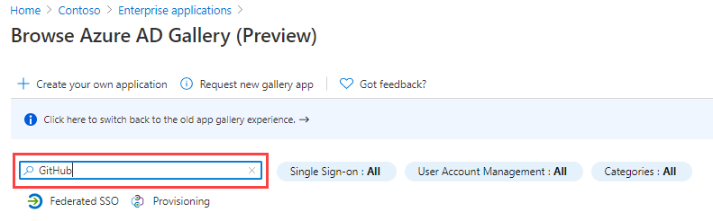

---
lab:
  title: "20\_: Implémenter la gestion des accès pour les applications"
  learning path: '03'
  module: Module 03 - Implement Access Management for Apps
---

# Labo 20 : Implémenter la gestion des accès pour les applications

## Scénario de l’exercice

Votre organisation exige que seuls des utilisateurs ou des groupes spécifiques aient accès aux applications d’entreprise. Affecte un utilisateur spécifique à une application.

#### Durée estimée : 5 minutes

### Exercice 1 : Configurer une application d’entreprise

#### Tâche 1 : ajouter une application à votre locataire Microsoft Entra

1. Connectez-vous au  [https://entra.microsoft.com](https://entra.microsoft.com)  en utilisant un compte d’administrateur général.

2. Ouvrez le menu du portail, puis sélectionnez  **Microsoft Entra ID**.

3. Dans le menu Identité, sous **Applications**, sélectionnez **Applications d’entreprise**.

4. Dans le volet Applications d’entreprise, sélectionnez **+ Nouvelle application**.

    

5. Dans la page Parcourir la galerie Microsoft Entra, dans le champ **Rechercher une application**, entrez **GitHub**.

    

6. Dans les résultats, sélectionnez **GitHub Enterprise Cloud – Enterprise Account**.

7. Dans **GitHub Enterprise Cloud – Enterprise Account**, passez en revue les paramètres, puis sélectionnez **Créer**.

8. Une fois le compte créé, vous êtes redirigé(e) vers le panneau Cloud GitHub Enterprise : compte d’entreprise.

#### Tâche 2 : affecter des utilisateurs à une application

1. Sur l’écran Cloud GitHub Enterprise : compte d’entreprise, dans la page Vue d’ensemble, sous **Prise en main**, sélectionnez **1. Attribuer des utilisateurs et des groupes**.

2. Dans le volet de navigation gauche, sous **Gérer**, vous pouvez également sélectionner **Utilisateurs et groupes**.

3. Sur la page Utilisateurs et groupes, dans le menu, sélectionnez **+ Ajouter un utilisateur/groupe**.

4. Sur la page Ajouter une affectation, sous **Utilisateurs et groupes**, sélectionnez **Aucune sélection**.

5. Dans le volet Utilisateurs et groupes, sélectionnez votre compte administrateur, puis **Sélectionner**.

    

6. Sélectionnez **Attribuer**.

