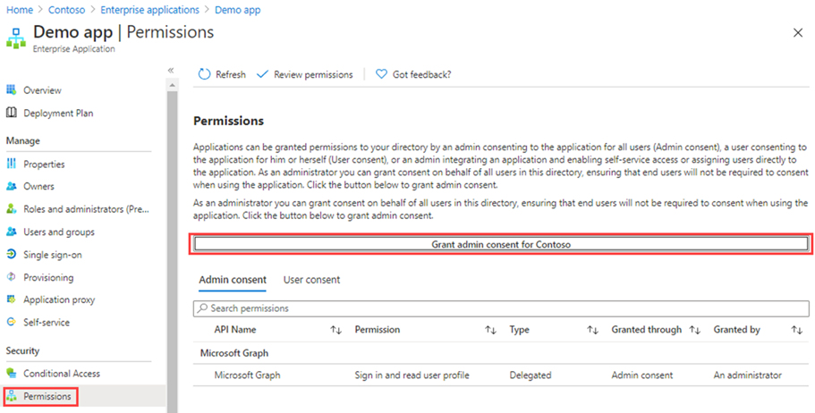

---
lab:
  title: "21\_: Accorder le consentement administrateur au niveau locataire à une application"
  learning path: '03'
  module: Module 03 - Implement Access Management for Apps
---

# Labo 21 : Accorder le consentement administrateur à une application au niveau du locataire

## Scénario de l’exercice

Pour les applications développées par votre organisation ou inscrites directement dans votre locataire Microsoft Entra, vous pouvez accorder le consentement administrateur au niveau locataire à partir de « Inscriptions d'applications » dans le Portail Azure.

#### Durée estimée : 15 minutes

### Exercice 1 : Consentement administrateur

#### Tâche 1 : accorder le consentement administrateur dans les inscriptions d’applications

   **Attention**, le fait d’accorder le consentement administrateur au niveau locataire à une application permettra à l’application et à l’éditeur de l’application d’accéder aux données de votre organisation. Examinez attentivement les autorisations demandées par l’application avant d’accorder le consentement.

Le rôle Administrateur général est requis afin de donner le consentement administrateur pour les permissions d’application à l’API Microsoft Graph.

1. Dans un exercice précédent, vous avez créé une application nommée Demo App. Dans le Centre d’administration de Microsoft Entra, accédez à **Identité** et **Applications**, sélectionnez **Inscriptions d’applications**, puis **Application de démonstration**.

2. Sur la page **Applicartion de démonstration**, localisez, copiez et enregistrez chaque **ID d’application (client)** et les **valeurs d’ID de répertoire (locataire)** afin de pouvoir les utiliser ultérieurement.

    **Notez que ** - **l’application de démonstration** est créée dans les labo précédents. Terminez-les avant de commencer celui-ci.

    

3. Dans le volet de navigation de gauche, sous **Gérer**, sélectionnez **Autorisations d’API**.

4. Sous **Autorisations configurées**, sélectionnez **Accorder le consentement de l’administrateur**.

    

5. Examinez la boîte de dialogue, puis sélectionnez **Oui.**

   **Attention**, l’octroi du consentement administrateur au niveau du locataire via des inscriptions d’applications révoque toutes les autorisations accordées précédemment à l’ensemble du locataire. Les autorisations précédemment accordées par les utilisateurs en leur nom propre ne seront pas concernées.

#### Tâche 2 : accorder le consentement administrateur dans les d’applications d’entreprise

Vous pouvez accorder le consentement administrateur au niveau locataire via Applications d’entreprise si l’application a déjà été approvisionnée dans votre locataire.

1. Dans le centre d’administration Microsoft Entra, accédez à **Identité > Applications > Applications d’entreprise > Application de démonstration**.

2. Sur la page **Application de démonstration**, dans le volet de navigation gauche, sous **Sécurité,** sélectionnez **Autorisations.**

3. Sous **Autorisations**, sélectionnez **Accorder le consentement de l’administrateur**.

    

   **Attention**, l’octroi du consentement administrateur au niveau du locataire via des inscriptions d’applications révoque toutes les autorisations accordées précédemment à l’ensemble du locataire. Les autorisations précédemment accordées par les utilisateurs en leur nom propre ne seront pas concernées.

4. Lorsque vous y êtes invité, connectez-vous à l’aide de votre compte d’administrateur général.

5. Dans la boîte de dialogue **Autorisations demandées**, passez en revue les informations, puis sélectionnez **Accepter**.
