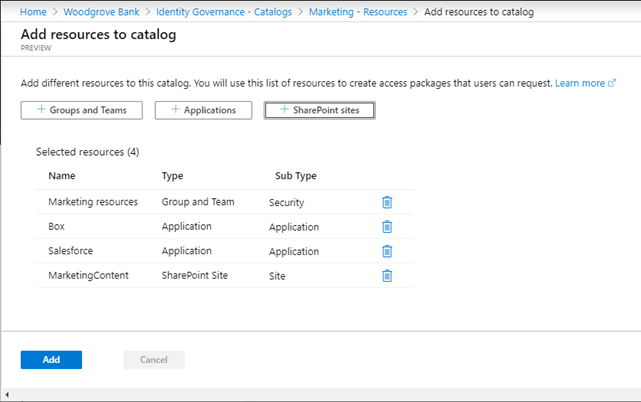
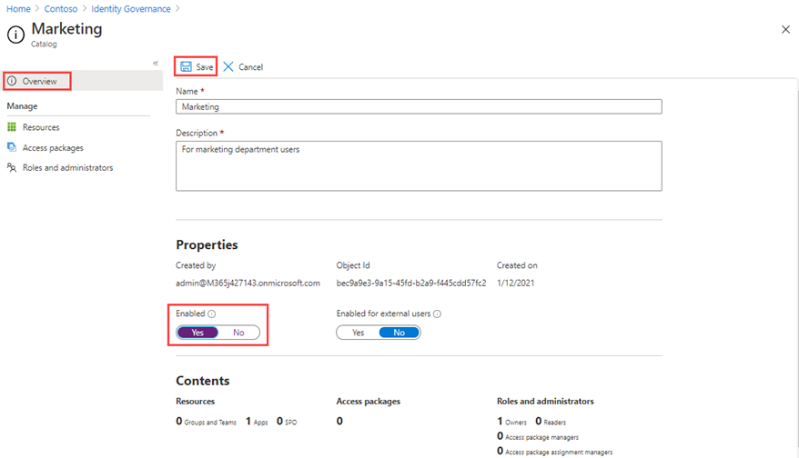

---
lab:
  title: "22 - Créer et gérer un catalogue de ressources dans la gestion des droits d’utilisation Azure\_AD"
  learning path: '04'
  module: Module 04 - Plan and Implement and Identity Governance Strategy
---

# Labo 22 - Créer et gérer un catalogue de ressources dans la gestion des droits d’utilisation Azure AD

## Scénario de l’exercice

Un catalogue est un conteneur de ressources et de packages d’accès. Vous créez un catalogue lorsque vous souhaitez regrouper des ressources et packages d’accès liés. La personne qui crée le catalogue en devient le premier propriétaire. Un propriétaire de catalogue peut ajouter d’autres propriétaires de catalogue. Vous devez créer et configurer un catalogue dans votre organisation.

#### Durée estimée : 15 minutes

### Exercice 1 - Créer des ressources dans la gestion des droits d’utilisation

#### Tâche 1 - Créer un catalogue

1. Connectez-vous à l’adresse [https://portal.azure.com](https://portal.azure.com) à l’aide d’un compte Administrateur général.

    **Important** : pour utiliser et configurer les conditions d’utilisation d’Azure AD, vous devez disposer des éléments suivants :
    - Abonnement Azure AD Premium P1, P2, EMS E3 ou EMS E5.
    - Si vous n’avez pas l’un de ces abonnements, vous pouvez obtenir Azure AD Premium ou activer la version d’évaluation de Azure AD Premium.
    - Un des comptes d’administrateur suivants pour le répertoire que vous souhaitez configurer :
        - Administrateur général
        - Security Administrator
        - Administrateur de l’accès conditionnel

2. Ouvrez **Azure Active Directory** et sélectionnez  **Gouvernance des identités**.

3. Dans le menu de gauche, sous **Gestion des droits d'utilisation**, sélectionnez **Catalogues**.

4. Dans le menu supérieur, sélectionnez **+Nouveau catalogue**.

    

5. Dans le volet Nouveau catalogue, dans la zone **Nom** , entrez **Marketing**.

6. Dans la zone **Description**, entrez **Pour les utilisateurs du service marketing**. Les utilisateurs verront ces informations dans les détails d’un package d’accès.

7. Sous **Activé, sélectionnez Non**.

- - **Activé pour les utilisateurs externes** permet aux utilisateurs des répertoires externes sélectionnés d’être en mesure de demander des packages d’accès dans ce catalogue. Aucune modification ne sera apportée à ce paramètre.

9. Vous pouvez choisir d’activer le catalogue pour une utilisation immédiate ou de désactiver si vous envisagez de le mettre en place ou de le garder indisponible tant que vous n’avez pas l’intention de l’utiliser. Dans le cadre de cet exercice, il n’est pas nécessaire d’activer le catalogue.

    

10. Sélectionnez Créer.

#### Tâche 2 - Ajouter des ressources à un catalogue

Pour inclure des ressources dans un package d’accès, les ressources doivent exister dans un catalogue. Les types de ressources que vous pouvez ajouter sont des groupes, des applications et des sites SharePoint Online. Pour les groupes, il peut s’agir de groupes Microsoft 365 ou de groupes de sécurité Azure AD créés sur le cloud. Pour les applications, il peut s’agir d’applications d’entreprise Azure AD, ce qui inclut les applications SaaS et vos propres applications fédérées avec Azure AD. Pour les sites, il peut s’agir de sites ou de collection de sites SharePoint Online.

1. Dans le panneau Gouvernance des identités, si nécessaire, sélectionnez **Catalogues**.

2. Dans la liste **Catalogues**, sélectionnez **Marketing**.

3. Dans le volet de navigation de gauche, sous **Gérer**, sélectionnez **Ressources**.

4. Dans le menu, sélectionnez + **Ajouter des ressources**.

5. Sur la page Ajouter des ressources au catalogue, passez en revue les options disponibles.  Ajoutez les éléments suivants :

   | Type de ressource | Valeur |
   | :------------- | :---------- |
   |  **Groupes et équipes** | Retail |
   |  **Applications** | Box |
   |  **Applications** | Salesforce |
   |  **Sites SharePoint** | Brand SharePoint <<<sélectionnez dans votre liste de sites SharePoint disponibles |

6. Vous n’avez peut-être pas de ressources dans des groupes et des équipes, des applications ou des sites SharePoint. Sélectionnez n’importe quelle catégorie de ressources, puis sélectionnez une ressource dans cette catégorie.

7. Pour cet exercice, vous pouvez choisir n’importe quelle ressource disponible.

    

8. Lorsque vous avez terminé, sélectionnez **Ajouter**. Ces ressources peuvent désormais être incluses dans des packages d’accès du catalogue.

#### Tâche 3 - Ajouter d’autres propriétaires de catalogue

L’utilisateur qui a créé un catalogue devient le premier propriétaire de catalogue. Pour déléguer la gestion d’un catalogue, vous ajoutez des utilisateurs au rôle de propriétaire de catalogue. Ainsi, les responsabilités de la gestion du catalogue sont mieux partagées.

1. Si nécessaire, dans le portail Azure, accédez à **Azure Active Directory**, **Gouvernance des identités**, puis **Catalogues** et sélectionnez **Marketing**.

2. Sur la page Catalogue marketing, dans le menu de navigation de gauche, sélectionnez **Rôles et administrateurs**.

    

3. Dans le menu supérieur, passez en revue les rôles disponibles, puis sélectionnez **+ Ajouter un propriétaire de catalogue**.

4. Dans le volet Sélectionner des membres, choisissez **Adele Vance**, puis cliquez sur **Sélectionner**.

5. Examinez le rôle qui vient d’être ajouté dans la liste rôles et administrateurs.

#### Tâche 4 - Modifier un catalogue

Vous pouvez modifier le nom et la description d’un catalogue. Les utilisateurs verront ces informations dans les détails d’un package d’accès.

1. Sur la page Marketing, dans le volet de navigation de gauche, sélectionnez **Vue d’ensemble**.

2. Dans le menu du haut, sélectionnez **Modifier**.

3. Vérifiez le paramètre et, sous **Propriétés** > **Activé**, sélectionnez **Oui**.

    

4. Sélectionnez **Enregistrer**.

#### Tâche 5 - Créer des révisions d’accès pour les utilisateurs invités

1. Les révisions d’accès permettent de gérer le cycle de vie des accès.Azure AD Identity Governance fournit un tableau de bord de vue d’ensemble montrant l’état des révisions d’accès. Sélectionnez **Révisions d’accès** dans le menu **Gouvernance des identités**.

1. Dans le menu Révision d’accès, sélectionnez **Révisions d’accès** pour configurer une révision d’accès pour les utilisateurs invités.Sélectionnez **+ Nouvelle révision d’accès** pour créer votre révision d’accès d’utilisateur invité.La vignette s’affiche pour configurer la révision d’accès pour les utilisateurs invités.

1. Dans la zone **Sélectionner ce qui doit être examiné**, sélectionnez **Équipes + Groupes**.

1. Sous **Sélectionner la portée de l’examen**, sélectionnez **Tous les groupes Microsoft 365 avec des utilisateurs invités**

1. Sous **Sélectionner l’étendue des utilisateurs**, sélectionnez **Utilisateurs invités uniquement**.

1. Sélectionnez **Suivant : Révision**.

1. La vignette suivante est l’emplacement où vous configurez les personnes qui examinent et approuvent l’accès, la fréquence d’examen de l’accès et l’expiration de l’accès.

1. Sous **Sélectionner des réviseurs**, choisissez **Propriétaires de groupes** comme réviseurs. **Remarque** : les utilisateurs invités ne doivent pas être autorisés à examiner leur propre accès, aux fins d’une bonne gouvernance des identités.

1. Entrez une **Durée (en jours)**, la valeur par défaut est 3, choisissez une **Récurrence d’examen** et une **Date de début** pour la révision.

1. Sélectionnez **Suivant : paramètres** et configurez les paramètres de la révision, ainsi que les actions à entreprendre lorsque l’utilisateur invité répond ou ne répond pas.  Une bonne pratique consiste à sélectionner **Appliquer automatiquement les résultats à la ressource** et à sélectionner **Supprimer l’accès** pour **Si les réviseurs ne répondent pas**. 

1. Sélectionnez **Vérifier + créer**, puis **Créer** pour créer la **révision d’accès**.

#### Tâche 6 - Supprimer un catalogue

Vous pouvez supprimer un catalogue, mais seulement s’il ne contient pas de packages d’accès.

1. Dans la page Vue d’ensemble du Catalogue marketing, dans le menu supérieur, sélectionnez Supprimer.

2. Dans la boîte de dialogue Supprimer, passez en revue les informations, puis sélectionnez **Non**.

    **Remarque** : nous aurons besoin de ce catalogue dans le labo suivant.
