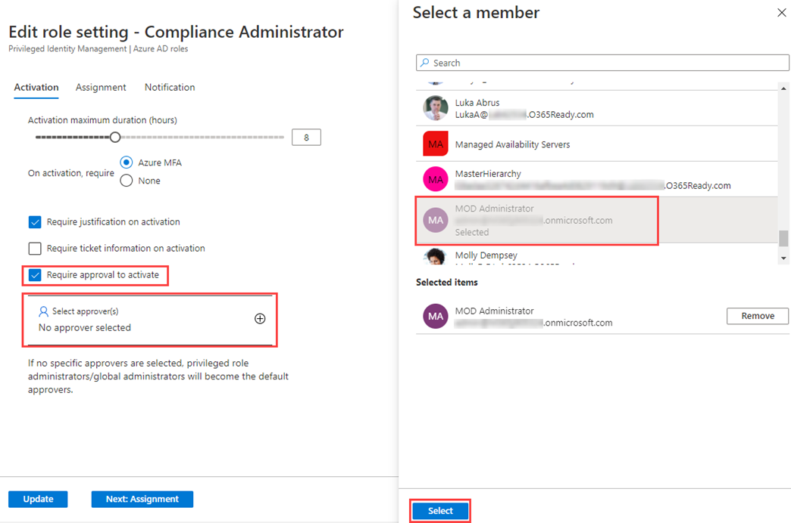
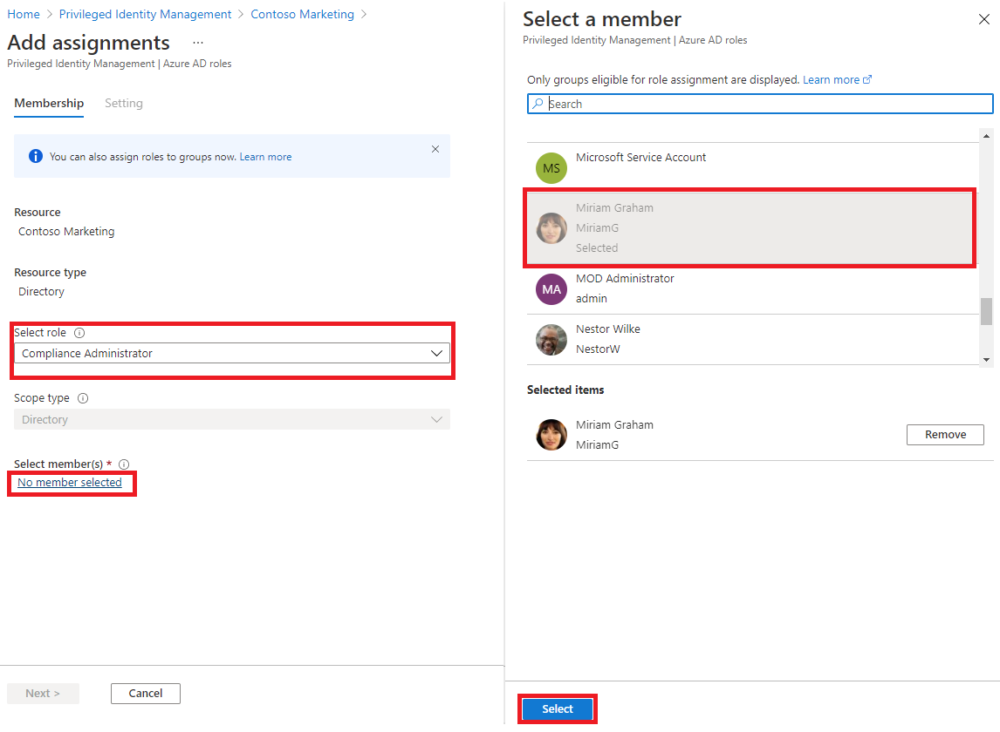

---
lab:
  title: "26\_- Configurer Privileged Identity Management pour les rôles Azure\_AD"
  learning path: '04'
  module: Module 04 - Plan and Implement and Identity Governance Strategy
---

# Labo 26 - Configurer Privileged Identity Management pour les rôles Azure AD

## Scénario de l’exercice

Un administrateur de rôle privilégié peut personnaliser Privileged Identity Management (PIM) dans son organisation Azure Active Directory (Azure AD), notamment modifier l’expérience d’un utilisateur qui active une attribution de rôle éligible. Vous devez vous familiariser avec la configuration de PIM.

#### Durée estimée : 30 minutes

### Exercice 1 - Configurer les paramètres d’un rôle Azure AD

#### Tâche 1 - Ouvrir les paramètres d’un rôle

Suivez ces étapes pour ouvrir les paramètres d’un rôle Azure AD.

1. Connectez-vous à  [https://portal.azure.com](https://portal.azure.com) en tant qu’administrateur global.

2. Recherchez, puis sélectionnez **Azure AD Privileged Identity Management.**

3. Sur la page Privileged Identity Management, dans le menu de navigation de gauche, sélectionnez **Rôles Azure AD**.

4. Sur la page démarrage rapide, dans le volet de navigation de gauche, sélectionnez **Paramètres.**

    

5. Passez en revue la liste des rôles, puis, dans la **Recherche par nom de rôle**, entrez **Compliance**.

6. Dans les résultats, sélectionnez **Conformité administrateur**.

7. Passez en revue les informations détaillées sur les paramètres du rôle.

#### Tâche 2 - Exiger une approbation pour activer un rôle

Si vous définissez plusieurs approbateurs, l’approbation est accomplie dès que l’un d’eux approuve ou refuse. Vous ne pouvez pas demander l’approbation d’au moins deux utilisateurs. Pour exiger l’approbation pour activer un rôle, procédez comme suit.

1. Dans la page Détails du paramètre de rôle, dans le menu supérieur, sélectionnez **Modifier**.

    

2. Sur la page Modifier le paramètre de rôle - Administrateur de conformité, activez la case à cocher **Demander une approbation pour activation**.

3. Sélectionnez **Sélectionner des approbateurs**.

4. Dans le volet Sélectionner un membre, sélectionnez votre compte administrateur, puis sélectionnez **Sélectionner**.

    

5. Une fois que vous avez spécifié les paramètres de rôle, sélectionnez **Mettre à jour** pour enregistrer vos modifications.

### Exercice 2 - PIM avec des rôles Azure AD

#### Tâche 1 - Attribuer un rôle

Avec Azure Active Directory (Azure AD), un administrateur général peut effectuer des attributions de rôles d'administrateur Azure AD permanentes. Ces attributions de rôles peuvent être créées via le portail Azure ou à l’aide de commandes PowerShell.

Le service Azure AD Privileged Identity Management (PIM) permet également aux Administrateurs de rôle privilégié d’établir des attributions permanentes du rôle Administrateur. En outre, les Administrateurs de rôle privilégié peuvent rendre les utilisateurs éligibles pour les rôles Administrateur d’Azure AD. Un administrateur éligible peut activer le rôle lorsqu’il en a besoin, puis l’autorisation expirera lorsqu’il aura terminé.

Suivez ces étapes pour rendre un utilisateur éligible pour un rôle d'administrateur Azure AD.

1. Connectez-vous à l’adresse [https://portal.azure.com](https://portal.azure.com) à l’aide d’un compte Administrateur général.

2. Recherchez, puis sélectionnez **Azure AD Privileged Identity Management.**

3. Sur la page Privileged Identity Management, dans le menu de navigation de gauche, sélectionnez **Rôles Azure AD**.

4. Sur la page Démarrage rapide, dans le volet de navigation de gauche, sélectionnez **Rôles.**

5. Dans le menu du haut, sélectionnez **+Ajouter des affectations.**

    

6. Sur la page Ajouter des attributions, sous l’onglet **Appartenance**, passez en revue les paramètres.

7. Sélectionnez le menu **Sélectionner un rôle**, puis sélectionnez **Administrateur de conformité**.

8. Vous pouvez utiliser le filtre **Rechercher un rôle par nom** pour vous aider à localiser un rôle.

9. Sous **Sélectionner des membres**, sélectionnez **Aucun membre sélectionné**.

10. Dans le volet Sélectionner un membre, sélectionnez **Miriam Graham**, puis **Sélectionner**.

    

11. Sur la page Ajouter des attributions, sélectionnez **Suivant**.

12. Sous l’onglet **Paramètres**, sous **Type d’affectation**, passez en revue les options disponibles. Pour cette tâche, utilisez le paramètre par défaut.

    - Les attributions de membres éligibles exigent des membres qu’ils effectuent une action pour utiliser ce rôle. Il peut s’agir de procéder à une vérification de l’authentification multifacteur (MFA), de fournir une justification professionnelle ou de demander une approbation aux approbateurs désignés.
    - Les attributions de membres actifs n’exigent pas des membres qu’ils effectuent une action pour utiliser ce rôle. Les membres actifs disposent en permanence des privilèges affectés au rôle.

13. Passez en revue les paramètres restants, puis sélectionnez **Affecter**.

#### Tâche 2 - Se connecter avec Miriam

1. Ouvrez une fenêtre de navigation privée.
2. Connectez-vous au portail Azure (https://portal.azure.com).
3. S’il s’ouvre avec un utilisateur connecté, sélectionnez son nom dans le coin supérieur droit, puis sélectionnez **Se connecter avec un autre compte**.
4. Connectez-vous en tant que Miriam.

   | Champ | Valeur |
   | :--- | :--- |
   | Nom d’utilisateur | **MiriamG@**`<<your domain.onmicrosoft.com>>` |
   | Mot de passe |  Entrez le mot de passe de l’administrateur du locataire (consultez l’onglet Ressources du laboratoire pour récupérer le mot de passe d’administrateur du locataire) |

5. Fermez la **boîte de dialogue Bienvenue dans Azure**.
6. Dans la barre **Rechercher dans les ressources, services et documents**, recherchez Azure Active Directory, puis ouvrez la page.
7. Sur la page **Vue d’ensemble**, recherchez **Mon flux**.
8. Sélectionnez **Afficher le profil** sous le nom de Miriam Graham. La page de profil de Miriam s’ouvre alors.
9. Sélectionnez **Rôles attribués**, puis sélectionnez **Affectations éligibles**.
10. Notez que le rôle **Administrateur de conformité** est à présent disponible pour Miriam.

#### Tâche 3 - Activer vos rôles Azure AD

Lorsque vous devez assumer un rôle Azure AD, vous pouvez demander une activation en ouvrant **Mes rôles** dans Privileged Identity Management.

1. Dans la barre **Recherche dans les ressources, services et documents**, recherchez Privileged.
2. Ouvrez la page **Azure AD Privileged Identity Management**.
3. Sur la page Privileged Identity Management, dans le menu de navigation de gauche, sélectionnez **Mes rôles**.

4. Sur la page Mes rôles, passez en revue la liste des affectations éligibles.

    

5. Dans la ligne rôle d’Administrateur de conformité, sélectionnez **Activer**.

6. Dans le volet Activer – Administrateur de conformité, sélectionnez **Vérification supplémentaire requise**, puis suivez les instructions pour fournir une vérification de sécurité supplémentaire. Vous ne pouvez vous authentifier qu’une seule fois par session.

    

    **Vérification** - En fonction de la configuration actuelle de l’environnement de labo, vous devez configurer l’authentification multifacteur (MFA) et vous connecter.

7. Une fois la vérification de sécurité supplémentaire terminée, dans le volet Activer - Administrateur de conformité, dans la zone **Raison**, entrez la **justification de l’activation de ce rôle**.

    **Remarque importante** : le principe du privilège minimum est que vous devez uniquement activer le compte pour la durée nécessaire.  Si le travail doit être effectué et ne prend que 1,5 heure, définissez la durée sur deux heures.  De même, si vous savez que vous ne pourrez pas effectuer le travail avant 13h, choisissez une heure d’activation personnalisée.

8. Sélectionnez **Activer**.

#### Tâche 4 - Attribuer un rôle avec une étendue restreinte

Pour certains rôles, l’étendue des autorisations accordées peut être limitée à une unité d’administration, un principal de service ou une application unique. Cette procédure est un exemple si vous attribuez un rôle qui a l’étendue d’une unité administrative.

1. N’oubliez pas de fermer les fenêtres du navigateur pour MiriamG, puis d’ouvrir le portail Azure en tant que compte d’administrateur.
2. Sur la page Privileged Identity Management, dans le menu de navigation de gauche, sélectionnez **Rôles Azure AD**.
3. Sélectionnez **Rôles**.
4. Sur la page Rôles, dans le menu supérieur, sélectionnez **+ Ajouter des attributions**.

5. Sur la page Ajouter des attributions, sélectionnez le menu **Sélectionner un rôle**, puis sélectionnez **Administrateur d’utilisateurs**.

6. Sélectionnez le menu **Type d’étendue** et passez en revue les options disponibles. Pour le moment, vous allez utiliser le type d’étendue de **Répertoire** .

   **Conseil** - Accédez à la page [https://docs.microsoft.com/en-us/azure/active-directory/roles/admin-units-manage](https://docs.microsoft.com/en-us/azure/active-directory/roles/admin-units-manage) pour plus d’informations sur le type d’étendue d’unité administrative.

7. Comme vous l’avez fait lors de l’affectation d’un rôle sans étendue restreinte, vous devez ajouter des membres et compléter les options des paramètres. Pour le moment, sélectionnez **Annuler**.

#### Tâche 5 - Mettre à jour ou supprimer une attribution de rôle existante

Suivez ces étapes pour mettre à jour ou supprimer une attribution de rôle existante.

1. Sur la page Ouvrir Azure AD Privileged Identity Management > Rôles Azure AD, dans le menu de navigation de gauche, sélectionnez **Attributions**.

2. Dans la liste **Affectations**, pour l’Administrateur de la conformité, passez en revue les options de la colonne **Action** .

    

3. Sélectionnez **Mettre à jour** et passez en revue les options disponibles dans le volet Paramètres d’appartenance. Lorsque vous avez terminé, fermez le volet.

4. Sélectionnez **Supprimer**.

5. Dans la boîte de dialogue **Supprimer**, passez en revue les informations, puis sélectionnez **Oui**.
